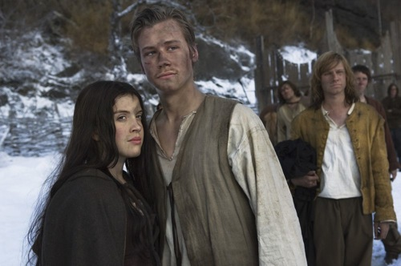

### Puntuación

**Intérpretes**

    

**Innovación**

    

**Reparto**

    

**Duración**

    

**Objetivo**

    

Esta película dirigida por [Marco Kreuzpaintner](http://www.imdb.es/name/nm0471086/) y guionizada por [Michael Gutmann](http://www.imdb.es/name/nm0349654/) puedo calificarla de correcta y aceptable. La película está bien ambientada, tiene buenos efectos especiales y viendo la película te quedas con la sensación de que es exactamente lo mismo que te promocionan en el tráiler. Vamos, que no te sientes estafado al verla. Quizá, cuando en la sinopsis se habla de que Krabat tiene que luchar contra el mago te esperas algo diferente a como es la lucha en sí, pero bueno, está bien para ser del género que es y tratarse de lo que se trata.

Los actores no son muy conocidos, al menos para mí, pero tienen un trabajo bastante correcto y actúan generalmente bien. Pese a la juventud de la mayoría de ellos. Como protagonista tenemos a [David Kross](http://www.imdb.es/name/nm1269088/) (**Krabat**), entre los amigos que se encuentra en el molino tenemos a [Daniel Brühl](http://www.imdb.es/name/nm0117709/) (**Tonda**), su principal amigo, y algunos otros como [Stefan Haschke](http://www.imdb.es/name/nm2477295/) (**Staschko**), [Sven Hönig](http://www.imdb.es/name/nm1310244/) (**Andrusch**), [Hanno Koffler](http://www.imdb.es/name/nm1269047/) (**Juro**) y, cómo no, [Christian Redl](http://www.imdb.es/name/nm0714943/) (**el Maestro**).

La trama trata de un joven (**Krabat**) que se ve abandonado, sin lugar donde ir, y **el Maestro** haciendo uso de la magia negra se mete en su mente y, mediante una voz, le da indicaciones de dónde debe ir y cómo llegar hasta el viejo molino donde él se encuentra. Al llegar, le propone ser su aprendiz. Él acepta y, con eso, aparte de trabajar duro para levar el molino adelante iría aprendiendo algunos rituales de magia negra pero, a su vez, todo su ser y tanto él como los demás jóvenes del molino sucumben a la magia negra del Maestro y están en todo momento controlados por él. Allí, están privados de libertad, ya que de ningún modo pueden alejarse del molino.

Cerca hay un pueblo, donde en su mayoría es habitado por mujeres. Los jóvenes suelen escaparse a él para poder contemplarlas. Y la única salida que tienen para conseguir su libertad, cuando se enamoran, es que el día de año nuevo la mujer a la que aman vaya al molino a pedir la mano de uno de los jóvenes. Aunque el Maestro se encarga de que eso no ocurra una vez descubre cuál es la chica de la que uno de sus jóvenes se ha enamorado.

Es una película interesante para pasar una tarde sin nada que hacer, aunque no puedo recomendarla encarecidamente porque no es ninguna obra de arte. Es entretenida y eso... Si la veis me contáis qué os pareció. :)
