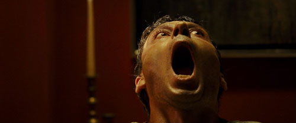

### Puntuación

**Intérpretes**

    

**Innovación**

    

**Reparto**

    

**Duración**

    

**Objetivo**

    

Estaba empezando a pensar si sería cosa mía, si estaría aburriéndome de ver películas y ya todas me aburrían de sobremanera. Estaba claro que no, porque tras ver esta película y aguantar del tirón quedándome con ganas de más me doy cuenta que lo que estaba haciendo era una pésima elección de películas para ver... ¡Porque vaya diferencia! ¡Vaya peliculón! Vaya efectos que tiene, menudo realismo le dan los personajes... ¡Y vaya actuación de la prota! Y ya de paso, menudo cambio le hacen a la pobre, casi ni se le reconoce.

Tras ver el título y la fotografía que encabeza esta crítica habréis podido imaginar, sin llegar siquiera a leer ni una línea de lo que escriba, y sin tener ni idea de la sinopsis de la película, que se trata de una película de las que a mí me van: terror y suspense. Y en este caso, además, de ufología mezclada con una extraña posesión demoníaca. Vamos, los ingredientes perfectos y la guinda final de un gran pastel que me harían pasarme toda la tarde, incluso el día, viendo películas como esta. ¡Y sin cansarme!

La película está dirigida y escrita por el estadounidense [Olatunde Osunsanmi](http://www.imdb.es/name/nm1069989/), deleitándonos con lo que, en esta película, podríamos decir que es el máximo reclamo: la protagonista [Milla Jovovich](http://www.imdb.es/name/nm0000170/) (**Abbey Tyler**); que aparte de que llama la atención visualmente (está como un tren), con papeles como este nos damos cuenta que, además, es una actriz estupenda. Y mira que se han empeñado en buen parte de esta película que el primer factor (el visual) pase desapercibido... porque madre, ¡cómo la dejaron a la pobre! Amén, podemos destacar el papel de [Will Patton](http://www.imdb.es/name/nm0001599/) (**Sheriff August**), que es un poquito cabroncete; el colega de **Abbey**, [Elias Koteas](http://www.imdb.es/name/nm0000480/) (**Abel Campos**) y el especialista en lenguas muertas, [Hakeem Kae-Kazim](http://www.imdb.es/name/nm0434444/) (**Dr. Awolowa Odusami**). Tenemos también a los dos pacientes: [Corey Johnson](http://www.imdb.es/name/nm0424819/) (**Tommy Fisher**) y [Enzo Cilenti](http://www.imdb.es/name/nm0162281/) (**Scott Stracinsky**) que también lo bordan ambos.

Bien, presentaciones realizadas, diremos que la película trata está basada en hechos reales... De hecho, al principio de la película, se comunica que algunas de las grabaciones y audios que se encuentran en la película son totalmente reales, y que son documentos que han sido prestados por la propia **Abbey Tyler**. Abbey, es una psicóloga con consulta afincada en Nome (Alaska), que suele practicar la hipnosis a sus pacientes para poder saber realmente lo que les ocurre y que se lo digan con franqueza para poderles ayudar de la mejor manera posible. Y hasta aquí no sería del todo extraño, y entraría dentro de lo _normal_, si no fuera porque en el pueblo donde se dice que se hizo el rodaje (Nome, recordemos) han habido bastantes desapariciones en los últimos años. Supuestamente, estas desapariciones serían abducciones. Y es el caso en el que se centra la película.

Los dos pacientes que podemos encontrar en la película sufren exactamente el mismo problema; no descansan bien por la noche. Tras hacer las correspondientes hipnosis, en ambos pacientes, el resultado es el mismo: por la noche observan como una lechuza les mira fíjamente desde la ventana de su habitación. Eso sí, cuando se les pregunta acerca de ella... También los dos tienen la misma reacción, pero eso es mejor que se vea en la propia película, así no adelanto nada a nadie. ;) Una cadena de sucesos acaban por casi trastornar a Abbey, perdiendo a su hija, retirándole la custodia de su hijo, y terminando seriamente demacrada por la tristeza, la impotencia, el dolor y el paso de los años.

No es una película que recordaremos con el paso de los años (como [Celda 211](http://fjp.es/celda-211/)), ni creo que marque un antes y un después en el cine (como el caso de [Avatar](http://fjp.es/avatar/)), pero sin duda se consigue con esta película lo que se proponen: sobresaltar al espectador de una forma impecable, con unos actores de prestigio, con un papel alucinante de todos ellos, y metiéndonos en la película de principio a fin.

Muy recomendada.
