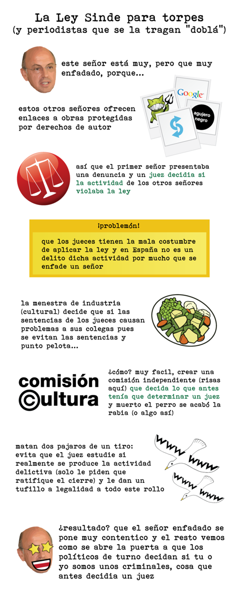

...Y periodistas que se la tragan _doblá_. :)

Recordando tiempo atrás... todo esto viene por la Ley que se acaba de aprobar. Más acerca de esto: [el manifiesto "en defensa de los derechos fundamentales en Internet"](http://fjp.es/manifiesto-en-defensa-de-los-derechos-fundamentales-en-internet/) ¡Qué cara más dura tienen, oiga!
