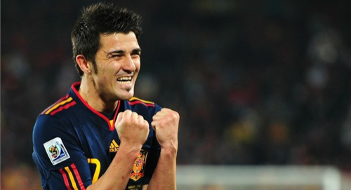

De nuevo la noticia es España. Y de nuevo, cual emblemático protagonista, David Villa. ¡Cómo vamos a echarte de menos en Valencia, crack! Un partido con un arbitraje francamente penoso. Pero que pese a ello, hemos podido batir. Un penalty pitado a Piqué, que para qué decir que no, lo era. ¿Qué pasó? ¡pues qué podía pasar! San Iker Casillas lo para. Justo después, en la contra, penalty para España. Se dispone Xabi Alonso a tirarlo... lo tira... ¡gol! Pero no podía ser, ya que los guaraníes habían fallado el suyo y este no podía darse como bueno. Resumiendo, que el penalty no vale y se repite... Xabi Alonso lo repite de nuevo y... esta vez lo falla... ¡Y no es eso sólo! A la salida del despeje (porque no fue parada) el portero guaraní comete otro penalty... ¡que no es pitado!

Pero nadie puede con Villa y su cita de cara al gol. Una jugada con tres tiros, ninguno de ellos entra excepto el de _el guaje_. Tiro, falla; tiro de nuevo, al palo... llega Villa... ¡Y la afición canta ILLA ILLA ILLA VILLA MARAVILLA! Villa GOL, Villa GOL, Villa GOL, ¡¡Villa GOOOOOOL!!

La Selección Española de Fútbol jamás había pasado de cuartos. Logramos pasar hace 2 años en la Eurocopa, y hoy mismo lo hemos logrado en el Mundial. ¡Se ha roto el maleficio! Ahora a por los alemanes, que cuando nos vean salir no podrán quitarse de la cabeza a esa selección que la sacó de la Eurocopa en la final, con un precioso gol de Torres.

Y a los argentinos: ¡que la sigan chupando! Mucho preocuparse _el dieguito_ de si España metió gol en _offside_ y de qué pasaría cuando nos enfrentáramos en semifinales... sin haber jugado los cuartos todavía contra Alemania. ¿Sabes lo que pasa cuando se abre demasiado la boca, _dieguito_? Pues eso, que te la cierran y no gusta nada. La venganza se sirve en plato frío.

**¡PODEMOS!**
