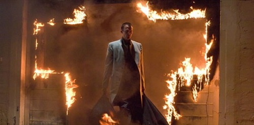

### Puntuación

**Intérpretes**

    

**Innovación**

    

**Reparto**

    

**Duración**

    

**Objetivo**

    

Aunque publicando este artículo el fin de semana en que el que se celebran los homenajes a las Fuerzas Armadas Españolas pueda parecer que vaya a hablar del cuerpo de la Legión, nada más lejos de la realidad. El tema que me ocupa es el de la película que se ha estrenado este fin de semana y que ya he visto: **Legión**.

La película está dirigida por [Scott Stewart](http://www.imdb.es/name/nm0829820/) y uno de sus principales ganchos como intérprete es el actor [Dennis Quaid](http://www.imdb.es/name/nm0000598/) (**Bob Hanson**); aunque podría decir que no es el principal personaje de la película, ya que éste es [Paul Bettany](http://www.imdb.es/name/nm0079273/) (**Arcángel San Miguel**, **Michael**), acompañado de otros que se ven a lo largo de la película como [Lucas Black](http://www.imdb.es/name/nm0085407/) (**Jeep Hanson**), [Tyrese Gibson](http://www.imdb.es/name/nm0879085/) (**Kyle Williams**), [Adrianne Palicki](http://www.imdb.es/name/nm1597316/) (**Charlie**) o [Charles S. Dutton](http://www.imdb.es/name/nm0001165/) (**Percy Walker**). Interpretando a _la oveja descarriada_ tenemos a [Kevin Durand](http://www.imdb.es/name/nm0243806/) (**Arcángel San Gabriel**).

Podría decirse que la película no innova en nada, ya que se trata de la típica película concienciadora americana que nos hace ver lo bueno y generoso que es Dios para con nosotros, los seres humanos, su creación. Y esto habrá quien se lo crea y quien no, pero es lo que nos hacen ver en la película. La trama de la película nos hace ver qué podría pasar si Dios perdiera la fe en su raza humana. Podemos ver de qué forma los Ángeles y Arcángeles (su ejército celestial) podrían causar el fin de lo que hasta hoy conocemos como _el mundo_. Y sólo se interpone entre sus planes el Arcángel San Miguel, que consciente de que su creador no había perdido del todo la fe en los humanos se enfrenta al Arcángel San Gabriel para impedir que se destruya la raza humana, o al menos por completo.

Dar más detalles sería generar _spoilers_ que no quiero generar, así que lo mejor es que si queréis la veáis por vosotros mismos. La película está entretenida. A mí en ningún momento de me ha hecho aburrida. Y en fin, para pasar una tarde en el cine está genial. No es una obra de arte, ni algo innovador que no se haya visto ya más veces de otras muchas formas, pero tampoco algo que desperdiciar.
