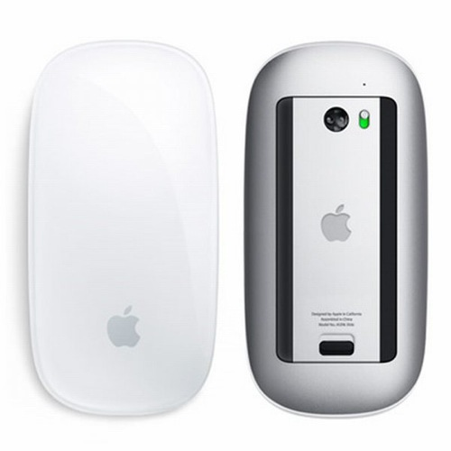
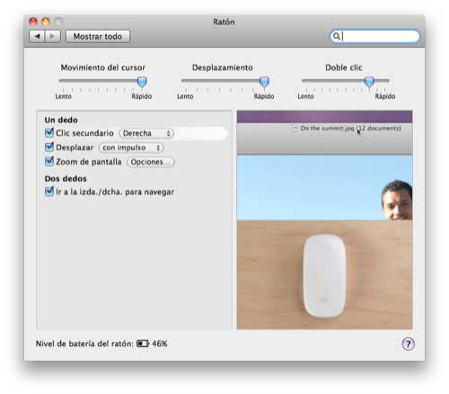
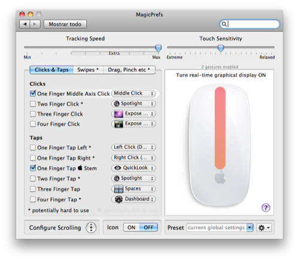

Como comenté en mi artículo de [primeras impresiones del iMac 21,5"](http://fjp.es/primeras-impresiones-del-imac/), algo que me había encantado del iMac es el Magic Mouse. Y creo que **se merece un artículo íntegro** para él, porque realmente es buenísimo. Pensaba que el trackpad de mi MacBook era una maravilla, que de hecho lo es, pero es que esto es _harina de otro costado_. Es, **sin duda alguna, el mejor ratón que he tenido hasta el momento**. Es **rápido, fácil de manejar, completísimo, y tremendamente ampliable en funciones** añadiéndole un panel de configuración del que más tarde hablaré. **El hecho de que sea multi-touch te permite configurar un montón de accesos directos a opciones y utilizarlo, en general, para un sinfín de cosas**. Es mucho más que un ratón, no cabe duda.

La imagen de arriba es el apartado para el ratón dentro del panel de Preferencias del Sistema de Snow Leopard. Como veréis, tiene tres configuraciones básicas en su parte superior: **movimiento del cursor**, **desplazamiento** y **doble click**. Hasta aquí, nada fuera de lo habitual, porque esta configuración la poseen todos los ratones. Ahora bien. Como sabemos, **el Magic Mouse tiene un único botón, que ocupa todo lo ancho y largo de éste, y además, superficie multi-táctil**. Y bien, aquí es donde viene la panacea de este ratón: la sección multi-táctil, que en la sección de la derecha podemos ver exactamente el gesto que deberíamos hacer para que ese gesto se realice con éxito. Más abajo, como tampoco podía faltar, **podemos ver el nivel de carga de las baterías** (**utiliza dos pilas AA**). Sobre cuánto tiempo duran las baterías todavía no puedo confirmarlo puesto que todavía funciona con las pilas que traía de casa.

Ahora sí, como dije al principio, **lo mejor que tiene este ratón es que es tremendamente ampliable en gestos gracias a su totalidad de superficie multi-táctil**. Y con simplemente instalar un plugin para las Preferencias de Sistema llamado [MagicPrefs](http://magicprefs.com/) obtenemos una **completísima configuración** tal y como se muestra en la captura de pantalla anterior. Como veréis, yo solamente tengo activado dos gestos, de los tantísimos que hay (que en las dos pestañas restantes hay muchos más), pero sobre todo, lo que más me gusta, es que **te acelera muchísimo más el desplazamiento del puntero del ratón**. A mí me gusta que los ratones sean sensibles cuando deben serlo (y éste lo es, y mucho), pero también me gusta, que si quiero desplazar el puntero rápidamente sea capaz de hacerlo muy rápido en muy poco espacio de movimiento real. Y con ésto, se consigue a la perfección: dando un desplazamiento suave, el puntero se mueve muy precisamente y muy despacio, pero con el mismo movimiento, ejecutado de forma rápida, obtenemos un desplazamiento a gran velocidad que, con moverlo un centímetro (más o menos), podemos cambiar el puntero de una esquina del monitor a otra opuesta. Y eso me encanta.

Así pues, con todo esto, como ya dije, **es el mejor ratón que haya tenido hasta el momento**. Y dudo mucho que haya otro ratón de similares características, que sea como éste, y que funcione tan, tan bien. Aunque nada es inmejorable, y según rumores y patentes realizadas por Apple, **ya están trabajando en un nuevo Magic Mouse** que, supongo, **será muchísimo mejor que éste**. Aunque, sinceramente, **ahora mismo no puedo concebir nada mejor**.
