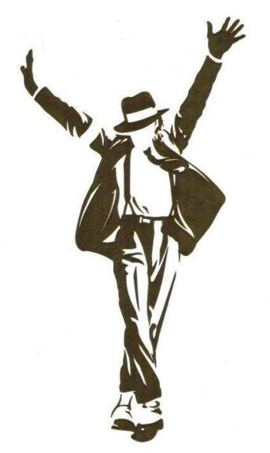

Nada más y nada menos que un año hace que este gran cantante falleció. Podría decir que ha pasado rápido el tiempo, que es lo que se suele decir, pero en mi caso realmente no ha pasado rápido. Simplemente, ha pasado. Sigo teniéndolo en la mente porque sigue siendo el cantante que más a menudo escucho. Tanto vídeos, como música. Sigue teniendo las mejores coreografías que he visto, las mejores canciones... Todo idéntico a lo que dije hace un año.

Crecer con Billie Jean, Black or white, Smooth criminal, Thriller, Man in the mirror, Who is it, Heal the world, You are not alone, Earth song... y tantas, tantísimas otras más, no ha tenido precio. Han hecho poder crecer escuchando buena música, cosa que generaciones venideras posiblemente no podrán decir.

¡Gracias por todo, una vez más, Jacko!
