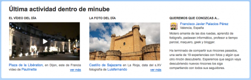

No conocía la existencia de [minube](http://www.minube.com/) hasta que hace un par de días, visitando no recuerdo qué blog, vi que en la sidebar había un widget que ponía minube y se podían apreciar lo que parecían ser destinos recientemente visitados. En fin, entré a ver qué era eso. La sorpresa que me llevé fue bastante grata: **es una red social de viajeros, donde puedes recomendar tus _rincones_ (como ellos lo llaman); que puede ser desde un hotel donde te hospedaste y te gustó, a un restaurante, una cafetería o incluso un monumento o paisajes dignos de recomendar** e intentar que los demás visiten. Como ellos mismos se definen:

La comunidad de viajes donde podrás descubrir destinos y rincones gracias a otros viajeros, comparar precios de vuelos baratos y hoteles, y sobre todo podrás compartir tus viajes.

No dudé un sólo instante en compartir por Twitter que estaba conociendo esta nueva (para mí) red social y que me gustaba mucho. Y a la vez, envié otro tweet donde anunciaba que estaba enviándoles una sugerencia: **habilitar la posibilidad de buscar amigos por Facebook o Twitter**. Es cierto que ya se ofrece la posibilidad de buscar contactos en tus direcciones de correo electrónico (Gmail, Hotmail y Yahoo) pero a veces con eso únicamente no es suficiente. Yo, al menos, casi todos mis contactos los tengo en una dirección de correo propia (dominio fjp.es) y **el vínculo de unión con casi todos ellos son las redes sociales** (bien Twitter, Facebook o incluso Tuenti).

Bien, tras este insignificante tweet me llegó un primer reply de @rauljimenez donde [me decía que habían tomado nota para realizarlo en breve](http://twitter.com/rauljimenez/status/8416593695). Simplemente **con ese detalle ya me gustó mucho la atención y el caso que hacían a los usuarios**; más teniendo en cuenta que la mayoría de comunidades o redes sociales el caso que le hacen a los usuarios es más bien mínimo. No suficiente con eso, al rato, recibo otro reply de @munix, donde [decía que estaba siguiendo mis viajes](http://twitter.com/munix/status/8424946433) y estuvimos charlando un rato. Pero no suficiente con todo esto (**que sinceramente, es mil veces más de lo que me esperaba**), @Anelka me [hace un retweet de uno de mis tweets](http://twitter.com/Anelka/status/8431113854) donde decía que ya había compartido todos mis rincones (aunque posteriormente aún compartí algo más). **Aparte de haberme seguido también en minube todos ellos**.

click para ampliar la imagen

Y no, aún no es suficiente con todo eso. Además, me entero gracias a @cesvlc que **hoy aparecía en la portada de minube como persona recomendada para visitar**. ¡Qué sorpresa! Y cuánto me ha gustado verme ahí. :D No me lo esperaba para nada.

Dicho todo esto, no me queda duda de que si por algo ha triunfado y triunfará esta red social de viajeros es precisamente por **la calidad humana de los responsables** de minube y **por la atención que tienen para con el usuario. Cosa que muchas otras empresas, redes sociales, comunidades y páginas en general deberían recordar**: que si no fuera por sus _clientes_ no sería lo que puedan ser, y que hay que cuidarlos. Y si se cuidan de este modo, como hace esta gente, **no me extraña nada que una comunidad pueda crecer a pasos de gigante**.

Por mi parte, voy a recomendar minube a todo aquél que me tope por delante. Se lo merecen. Y ahora, por si os interesa visitarme...

