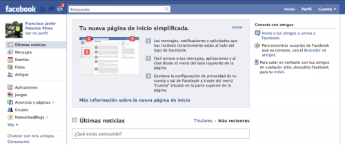

click en la imagen para ampliar

Pues sí, **de nuevo han rediseñado Facebook**. Estos chicos no paran. Pero la verdad es que cada vez que tocan algo lo hacen en mayor o menor medida con cabeza. Quiero decir, que **normalmente los cambios son, en su mayoría, tremendamente acertados**. Como es el caso que nos ocupa, por ejemplo. Estamos ante un rediseño poco arriesgado (como debe ser si no queremos alarmar a nuestros usuarios), con cambios relevantes en la organización, que aumentan su simplicidad y funcionalidad. Gustos personales de cada uno aparte, es un gran rediseño. Y con un cambio mucho menos trascendental que la última vez, donde cambió como de la noche al día y muchos usuarios no estaban de acuerdo (vale, esto siempre sucede)... ¡Si hasta se crearon grupos en contra de Facebook, para que regresaran al diseño anterior...! (sí, como si les fueran a hacer caso). xD

Bien, **generalmente todo el cambio me gusta**. Aunque hay una cosa que, para mí, tenía bastante importancia... Y ésta era **la barra de acceso directo a las aplicaciones** más utilizadas o a las que, simplemente, tú podías elegir. **Ahora, si bien podemos seguir accediendo a ellas desde el buscador, deja de ser tan rápido y, por supuesto, tan cómodo**. Algo que comparto con @cesvlc es que **la barra de chat que han dejado queda como un pegote puesto ahí como dejado caer**. La verdad es que queda bastante mal. No así la idea de poner los amigos conectados en la barra lateral izquierda, pero en ese caso, podrían haber centrado todo el chat en la barra lateral y dejarse de **esa pseudo-barra, fea, con position: fixed;**.

En fin, otro rediseño más que veremos con nuestros ojos. Y a este paso, los que nos quedan. Y aunque pueda no gustar a todo el mundo... siempre será mejor que estén adaptando la página a lo que se requiere por la mayoría de usuarios que dejarla fija y no tocarla nunca... dando la impresión de que es una página abandonada, ¿no? :)

Ya veremos a ver cuánto tardan los de Tuenti en plagiarlo. xD
