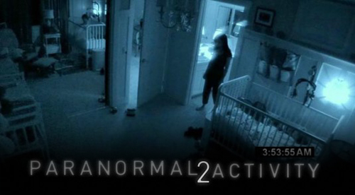

### Puntuación

**Intérpretes**

    

**Innovación**

    

**Reparto**

    

**Duración**

    

**Objetivo**

    

Ya he podido ver esta película que, como no podía ser de otra forma y me sucede con todas las de su género, me ha gustado mucho. Habiendo visto la primera parte en su día, y habiéndola visto de nuevo antes de ver la segunda parte para recordarla con más exactitud, creo que puede hacer una valoración bastante real de ésta.

Dirigida por [Tod Williams](http://www.imdb.es/name/nm0931095/), con los papeles protagonistas de [Brian Boland](http://www.imdb.es/name/nm1705210/) (**Dan Rey**), [Molly Ephraim](http://www.imdb.es/name/nm1454378/) (**Ali Rey**), [Sprague Grayden](http://www.imdb.es/name/nm0337042/) (**Kristi Rey**), [William Juan Prieto](http://www.imdb.es/name/nm4149255/) (**Hunter Rey**); con papeles secundarios de [Katie Featherston](http://www.imdb.es/name/nm2209370/) (**Katie**), [Micah Sloat](http://www.imdb.es/name/nm2913790/) (**Micah**), [Vivis Cortez](http://www.imdb.es/name/nm0173011/) (**Vivis**) y [Seth Ginsberg](http://www.imdb.es/name/nm2730930/) (**Brad**).

Es cierto, y normal, que la primera parte me haya gustado más en su día de lo que me gustó cuando ahora la volví a ver. Normalmente, cuando has visto una película más o menos conoces el progreso de la misma, aunque no lo sepas de memoria, sí sabes aproximadamente _por dónde van a ir los tiros_, como se diría. Esto, como digo, es normal. Lo que no es tan normal es que, aun siendo la segunda vez que la veía, me haya asustado más con la primera que con la segunda parte.

Centrándome en la segunda parte, creo que sobre todo al principio hay mucha grabación de más. Me explico, tal como pasaba con la primera parte, van grabándose las noches, y parte de los días que los habitantes pasan en esa casa también, pero sobre todo las noches. Durante el transcurso de la película, creo que se podría haber sacado más jugo si desde el principio hubiesen ocurrido más fenómenos paranormales. No quiero usar spoilers, pero cuando la veáis o si ya la habéis visto, sabréis que lo que digo es cierto. Después, cuando empiezan a pasar cosas realmente serias (casi al final de la película), es cierto que hay tres momentos exactos en los que te asustas de verdad; dos de ellos, porque ni siquiera te esperas que el susto vaya a estar ahí, en el tercero, un poco menos porque te lo esperas, pero asusta igual que los demás.

Resumiendo: a quienes os gusten las películas de este género, os gustará seguro. Pasar mucho miedo, al menos si sois como yo, no pasaréis mas que en las ocasiones citadas, que no es miedo si no el susto que te da al no esperártelo. Ideal para ir al cine con alguna amiga a la que le den miedo este tipo de películas y no os importe que se os arrime a vosotros. ;)

Ya me contáis qué os pareció, si la veis o la habéis visto.
