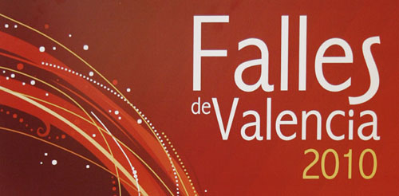

No puedo salir de mi asombro al enterarme que **la Ley de Costas no permite que se dispare las Mascletà Napolitana que, desde hace once años, lleva disparándose** en las fiestas falleras de Valencia. **No sé cómo puede existir gente tan ruin, repugnante, retrógrada, aguafiestas, insensata, inconsciente, malintencionada, vil, carroñera, estúpida y dictadora**. No lo concibo.

¿No nos dicen que busquemos una alternativa donde poder disparar esta mascletà? **¡PERO SI NO NOS DEJÁIS ALTERNATIVAS, CABRONES! ¡NO EXISTE ALTERNATIVA QUE CUMPLA LAS ESCANDALOSAS EXIGENCIAS QUE NOS OBLIGÁIS A CUMPLIR!** Hace unos años hasta quisieran retirar las mascletàs del 1 al 19 de la Plaza del Ayuntamiento, porque pensaban que era un lugar demasiado reducido. **No tienen suficiente con cada año estar cambiando los kilos de pólvora permitidos, los kilos de pólvora por cada carcasa, los metros máximos a los que podrán elevarse las carcasas, etc... ¿AHORA VIENEN DIRECTAMENTE A JODERNOS LA MEJOR MASCLETÀ QUE DISPARAMOS EN FALLAS? ¡Es una poca vergüenza!**

Deberían hacerse ver que mientras en otros países utilizan la pólvora para matarse los unos a los otros, nosotros preferimos hacer un espectáculo musical. Que podrá gustar a unos, y disgustar a otros, **PERO FORMA PARTE DE NUESTRA TRADICIÓN**. Y como tradición que es, deberían respetarla.

Si así es como quieren que gobierne el Partido Socialista en Valencia, me parece que la llevan clara. **¡LAS FALLAS, A LOS VALENCIANOS, NO NOS LA TOCAN NI DIOS!, ¿ENTENDÉIS?**

Hasta los cojones estoy de esta gentuza.

**EDITO: AL FINAL EL AYUNTAMIENTO DE VALENCIA HA CONSEGUIDO QUE SÍ HAYA MASCLETÀ NAPOLITANA. ¡ZAS!, EN TODA LA BOCA.**
