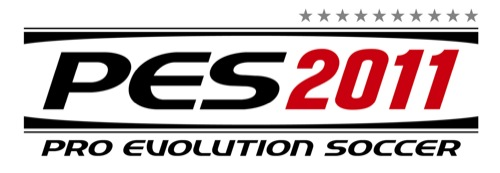

Llevo días probando este fantástico juego, y aparte de sacar conclusiones, quiero hacer desde aquí cosas que creo que podrían mejorar el juego y darle más realismo. Lo primero decir que me parece genial en todos los aspectos, tanto en jugabilidad como en gráficos. Los gráficos de los jugadores, respecto a su antecesor, han mejorado notablemente. Además, y sobre todo, la jugabilidad. En el PES2010 prácticamente los pases (en general, largos, cortos, al hueco...) iban directos al compañero. Y si no, él se movía para que fuera así. Ahora no es así, si la pasas mal, se la lleva el oponente o se va fuera. Y eso a mí personalmente me encanta, porque hace que te esfuerces más por hacerlo mejor.

No voy a realizar ningún análisis técnico de los modos de juego y todo eso, porque echándole una miradita a Google podremos encontrar cientos, y realizados por expertos, que sin duda alguna lo habrán hecho mejor que yo. Y además, como que no estoy por la labor de reinventar la rueda. Lo que sí me gustaría es decir en qué creo yo que se podría mejorar este gran juego. Que posiblemente no serán del agrado de todos, pero a mí sí me gustaría que lo tuviera. Empezamos.

- En el modo **Ser Leyenda**, estaría genial, para dar más realismo, que aunque tú no puedas gestionar la alineación o cambios durante el partido, sí tuvieras la posibilidad de pedir otra posición a nivel técnico, o _pactar_ con el compañero que ocupe esa posición un cambio breve. Además, la posibilidad de poder pedirle el cambio al técnico. Quizá no sea muy útil, pero sí realista.
- Tanto en el modo **Ser Leyenda** como en **Liga Master**, poderse habilitar (o no) una opción para que los entrenamientos sean _en vivo_. Quiero decir, entre partidos una opción para poder entrenar tal y como todos los futbolistas hacen. Que esté a elección de cada cual habilitarla o no. Y con ella habilitada, que depende de como te salgan los entrenamientos subas más rápidas las stats o más lento. Y todo esto independientemente de lo que de por sí suban durante el transcurso del partido, como hasta ahora.
- Así como en el modo **Ser Leyenda** puedes ir personalizando la apariencia del jugador, porque un jugador no lleva toda una misma temporada las mismas botas (por ejemplo), creo que estaría bien que esta opción también la llevase el modo **Liga Master**. Quizá que no se pueda personalizar tanto como en el otro modo, pero sí un mínimo. Daría más realismo.
- En cualquier tipo de modo de juego, **que los árbitros fueran más realistas**. Y esto es un defecto que ocurre, que a veces agrada o a veces no, pero ocurre. Y negarlo es de bobos. Para dar más realismo, los árbitros deberían ser menos perfectos. Más condescendientes con algunos equipos o jugadores mediáticos. O, que simplemente, a veces fallen. Tanto en contra como a favor, eso sí. Pero dudo mucho que exista árbitro alguno tan perfecto como los del juego.
- En el modo **Ser Leyenda**, que cuando un jugador lleve mucho tiempo en el equipo y sea un jugador _de peso_ en el vestuario, o bien sea un jugador mediático y famoso, tenga algún tipo de _poder_ especial sobre el juego. Que pueda comunicarse de alguna forma con el entrenador para las tácticas de juego, algo especial. O en caso de los capitanes, ídem. Que no sea solamente llevar el brazalete en el campo, que se pueda hacer algo más. Estaría bien.

Amén de todo lo anterior, y para asemejarse más al FIFA, debería tener más equipos licenciados, y más ligas de más países. Aunque eso va poco a poco, se ve que va, porque del PES2010 al PES2011 ya han habido notables diferencias. Y eso se nota, y se agradece. Porque además, hay más variedad de juego. Y aunque no elijas equipos de otros países, a la hora de hacer traspasos tienes muchas más opciones, porque para qué negarlo, en Latinoamérica hay jugadores buenísimos a los que poder ir fichando, y que cada vez hay más posibilidades de que estén en este juego y, sobre todo, en versiones futuras de éste.

Resumiendo, es un gran juego, pero como a todos, le falta cosas por mejorar. Sobre todo para hacerlo más realista. ¡Paciencia! **Vosotros qué, ¿habéis probado el juego? ¿os gusta? ¿qué propondríais para que mejorara? ¡Opinad!**
