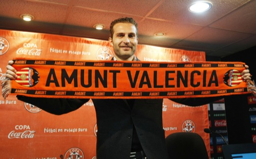

**Quan arriba la nit, encara soc Baraja... i ho seré sempre.** Y es una pena que haya gente que cuestione a persona como Baraja. Una auténtica pena... y una auténtica vergüenza debería ser para los directivos del Valencia CF. El sábado pasado además de presenciar un lamentable partido de nuestro Valencia CF ante el Villarreal, que casi se veía venir a leguas, pudimos ver también como el lumbreras de **Manuel Llorente** (por desgracia, actual Presidente de le entidad) **anunciaba en rueda de prensa que en el próximo partido, en Mestalla, sería la despedida de Rubén Baraja** como jugador blanquinegro ya que finaliza el contrato y no van a renovarlo. Y no habría noticia que peor pudiera sentarme mal que ésta. Que aunque también se veía venir, quería guardar la esperanza de que no fuese así.

Al igual que han hecho con más jugadores, esta vez no será una excepción. Y **el pobre de Rubén Baraja saldrá por la puerta de atrás, tal como llegó**. Lamentablemente esta entidad no se ha caracterizado jamás por rendir el homenaje que se merecen las grandes leyendas de este club, y cuando parecía que habría una oportunidad de enmendar este error que en otros clubes de España no sucede nunca... ¡tampoco! De las dos opciones que había, optan por la peor. Y qué queréis que os diga, la excusa de que no se renovará a Baraja por evitar un gasto y así poder salir más fácilmente de la deuda me parece una sandez monumental, porque la ficha de _El Pipo_, aparte de que es mucho más baja de lo que debería ser para un jugador de su talla, no va a aliviar la sobrecarga en forma de deuda que ahora mismo tiene el Valencia CF.

**Un jugador que ha estado para las duras y para las maduras; que ha sabido defender al escudo y a la entidad por encima incluso de sus propios intereses; que en los peores momentos del club ha dado la cara tanto por la Directiva, como por el Cuerpo Técnico y cómo no, por sus compañeros;** un jugador que pese a que no sea valenciano (señores, atención, que para sentir el club no se necesita ser de la tierra) ha demostrado tener un talante magistral en todos los casos; que aunque le hayan apartado directamente del club, como a otros, a éste no se le ha pasado ni por un momento por la cabeza denunciar al club que está dándole de comer durante tantos años; **una persona que**, sin lugar a dudas, **en la época en la que estuvimos apunto del descenso a segunda, supo tirar del carro** y animar a todos sus compañeros a tirar adelante; un jugador que **participó y ayudó muchísimo a que en dos temporadas consecutivas se llegara a la final de la Champions League; y justamente el mismo que estaba cuando, de la mano de Rafael Benítez, el Valencia CF pudo maravillar a propios y a extraños consiguiendo el doblete allá por el año 2003-2004** (¡qué tiempos aquéllos!); incluso sin remontarnos tanto tiempo atrás, **podremos recordar el papel tan importante que realizó cuando pudimos ganar en 2008 la Copa del Rey de la mano de Ronald Koeman**.

Y lo peor de todo no es que vayan a cepillárselo sin más, **lo peor es que esta temporada ha rendido de maravilla** (el tiempo que a Unai Emery le ha dado la gana contar con él...), **y que no tengan un recambio para él tan fiable**, y que no haya nadie más en el equipo que sepa tocar el balón como lo hace él, **nadie en el club que sepa dar pases milimétricos como lo hace él**, y nadie que tenga dotes de liderazgo, fuerza y garra como los tiene él.

A este jugador es al que el próximo fin de semana despediremos en Mestalla por la puerta de atrás, sin un mísero homenaje, sin la posibilidad de participar en el club con algún cargo que honre en cierto modo su trayectoria con el club. Nada. **Esta es la pésima forma de actuar que tienen en este Valencia CF que más que uno de los grandes de España parece una banda de patio de tercera regional**. Y no es que me guste reconocerlo, pero es lo que se deja ver por las actuaciones que podemos ver semana tras semana en el club. ¿Y **todo esto es lo que sabe hacer un presidente de pacotilla puesto a dedo por una entidad privada como Bancaja**? ¿**Es lo único que se puede hacer ganando 28000€ al mes**?...

Si es que le queda algo de vergüenza, Sr. Manuel Llorente, que sinceramente creo que ni la tiene ahora, ni cuando estuvo arruinando el Pamesa Valencia (ahora Power Electronics Valencia), ni cuando estuvo hace tiempo como directivo en el Valencia CF (que, permítame decirle, que fue por su puta culpa por lo que se marchó Rafael Benítez del Valencia, que sin duda alguna se merecía más que usted seguir estando en este equipo). Sigo, si tiene algo de vergüenza **debería ver lo que han hecho esta temporada, por ejemplo, en el Deportivo de La Coruña con Valerón**. Que como el caso que nos ocupa, Valerón no es gallego (La Coruña está en Galicia, por si no lo sabe), si no que es del mismo pueblo que Silva (sí, ese que a toda costa quiere vender que es de aquéllas islas que están allá lejos... ¡sí! esas que también son de España), y como para la afición y para la historia del Depor es toda una institución, **teniendo la misma edad que el jugador a quien usted va a tirar a patadas por la puerta de atrás, Rubén Baraja**, van a ofrecerle un contrato como jugador hasta que él aguante y, después, se convertirá en personal técnico del club: asesorando al Presidente, al entrenador, ejerciendo de entrenador del filial, o donde se le necesite. Y eso es lo que se diría hacer las cosas bien y con cabeza. **Lo mismo que se quiso hacer en su momento con Amedeo Carboni en el Valencia pero que no hubo forma de conseguirlo** (¡y lo que muchos nos hemos arrepentido de ello...!). Ahora, si de verdad tiene algo de vergüenza, **debería largarse de este club y permitirnos que nos libremos de la escoria que tanto usted como la Directiva de la Fundación Valencia CF han blindado con siete candados teniendo todavía en su poder la mayoría accionaral de este club que, supuestamente, iba a ser el más democrático de la Liga Española**. Y como siempre, no se ha podido ver ahí mas que el timo de la estampita. Ahora, si de verdad le queda vergüenza, no mire cuán de malos para el Valencia pueden ser Vicente Soriano y su grupo de inversores, Dalport, y **fíjese más cuán de mal puede hacerle al club que está presidiendo y del cual tan aficionado se considera si sigue gestionando el club de forma tan pésima**.

**Baraja, la afición siempre estará contigo**.
