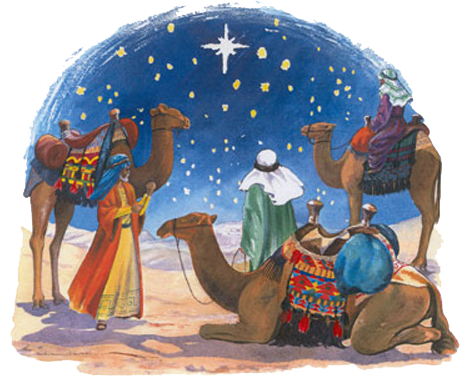

Queridos Reyes Magos...

Empiezo a escribir tal cual empezaba cuando tenía algunos años menos. Eso sí, con bastante menos ilusión que antes. Este año sabéis que he sido muy bueno: no he matado, ni extorsionado, ni manipulado, ni robado, ni maltratado a nadie. En ningún momento, lo sabéis. Me he portado bien con mis semejantes y he ayudado a las personas que me rodeaban, dentro de mis posibilidades. Ya sabéis eso que se dice, que quien hace o da lo que puede, no está obligado a más.

Este año, como el pasado, sé que no vais a acordaros de pasar por mi casa, pero lo comprendo porque con eso que hace poco me mudé de casa y no os avisé, no sabéis dónde vivo ahora mismo. Aunque os recuerdo que tengo vecinos; si mis regalos no sabéis dónde dejarlos, podéis dejarlos en casa de algún vecino y ya me pasaré a por ellos. Seguro que, donde los dejéis, son buena gente y cuando vaya a por ellos estarán ahí esperando para dármelos. Hay que confiar en la calidad humana de nuestra especie, ¿no?

Bien, no seré demasiado exigente. Y aunque como sois tres, y magos, podríais traerme muchas cosas; solamente os pediré una: **un iPhone 3Gs**. Vosotros, que sois magos, sabéis la cantidad de años que llevo detrás de un _cacharrito_ de estos. Y entre que vosotros no os habéis acordado de mí, y que yo no he podido, al final nunca he tenido la oportunidad de tener uno.

Seguro que esta noche dormiré plácidamente, sin estar pendiente a ver si os oigo u os veo; porque sé que no vais a venir. Mañana, tampoco me levantaré con ganas de ver qué habéis dejado para mí, porque al igual que otros años, sé que no habrá nada. No obstante, me apetecía rememorar cuando os escribía hace años, que sí me hacíais caso, por si acaso este año también me hacéis. El error pudo haber sido que en años anteriores no os escribí ninguna carta. Y claro, quizá no seáis tan magos como pienso y no podáis adivinar mis pensamientos... o no tengáis hueco para hacerlo, teniendo que visitar a tantas y tantas familias.

Con un fuerte abrazo, me despido de los tres. No sin antes recordaros, que sabiendo que no vais a venir no os dejaré nada preparado para reponer fuerzas, pero que sepáis que si lo necesitáis podéis pasar a la cocina y serviros vosotros mismos.

Gracias.
