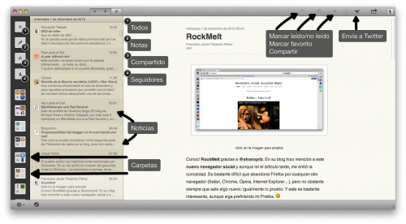

  
click en la imagen para ampliar

Quienes me sigáis por Twitter os habréis dado cuenta que en tres ocasiones ([1](http://twitter.com/#!/fjpalacios/status/10017452490498048), [2](http://twitter.com/#!/fjpalacios/status/10066818936872960) y [3](http://twitter.com/#!/fjpalacios/status/10299474404442112)) escribí sobre [Reeder](http://reederapp.com). Para quienes no sepáis qué es Reeder, es muy fácil: se trata de **una aplicación que conecta con tu cuenta de Google Reader y te permite leer y gestionar tus feeds sin necesidad de tener que entrar a la página de Google Reader**.

Lamentablemente, nunca pude probarla ya que hasta el momento sólo estaba disponible para iPhone e iPad, pero había visto vídeos de ella y me encantaba cómo funcionaba. Y no fue hasta ayer cuando salió a la luz el lanzamiento de [la primera beta para Mac](http://madeatgloria.com/brewery); todavía le faltan cosas por implementar, como una beta que es, pero no he detectado en dos días de uso intensivo ni un único fallo, error, o cuelgue. Así que podría decir que **su funcionamiento es francamente bueno siendo tan sólo una versión beta**.

Cuando pruebo una aplicación de este tipo, siempre la pruebo bajo el escepticismo de saber que la aplicación debe ser francamente buena para que me convenza, porque **hay muy pocas aplicaciones de este tipo que superen la calidad que tiene Google Reader** desde su propia página web. Hasta ahora, todo lo que había probado y que había llegado a ello a través de recomendaciones en otros blogs, foros y páginas, nunca me había gustado. ¡Pero ay Reeder, ay! Esto cambia completamente todo. **Supera con creces cualquier expectativa que tuviera depositada en una aplicación de este tipo. Sencillamente, es genial**.

En la imagen que encabeza este artículo se puede ver la apariencia estética de la aplicación. He marcado con notas cada cosa lo que es. Y si os fijáis, en la barra de tareas (arriba, a mano derecha), añadí un acceso directo a Twitter, para poder enviar lo que esté leyendo a Twitter, pero puede hacerse también con tu cuenta de Delicious, Instapapper, ReadItLater, Pinboard o Zootol. Cuando la beta deje de ser beta y se convierta en una versión final, también tendrá la opción de enviar a Facebook, opción con la que ya cuentan las versiones para iPhone e iPad.

Yo no puedo pedirle más a una aplicación de este tipo: **fluida, bonita, limpia, fuente de texto grande**... **¿Será esta la definitiva?** Por el momento ya no uso la web de Google Reader. A ver qué más sorpresas nos trae la primera versión final.
