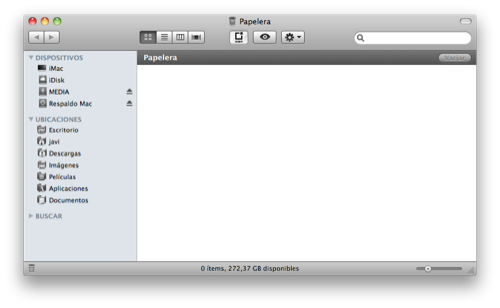

Aunque hasta el momento no había tenido problemas con la papelera de Mac, llegaron. El típico problema que no te deje vaciar la papelera porque algún archivo esté usándose es bastante frecuente, así que lo excluyo a la hora de decir que no he tenido problemas con la papelera. Y ya que lo menciono, por si alguien se lo pregunta, comento la solución. La forma _bestia_: cerrar sesión (que no reiniciar) e iniciar de nuevo; la forma más correcta: usar alguna aplicación como [Trash it!](http://www.macupdate.com/info.php/id/8214/trash-it!). Con [Onyx](http://www.macupdate.com/info.php/id/11582/onyx) (o similares) también se puede solventar.

A lo que iba, que me desvío. Expulsé un **.dmg** junto con un archivo más, enviándolos ambos a la papelera (forma cómoda donde las haya). Más tarde, intenté eliminar otro archivo, pero me salía un mensaje nuevo en pantalla: **Este item se eliminará inmediatamente. Esta acción no puede deshacerse.** No me sonaba de nada, pero pensé que quizá no me había fijado y sucedía siempre. Acepté y es cuando me di cuenta que realmente era nuevo, ya que el archivo no se había ido a la papelera, si no que se había eliminado completamente, sin posibilidad de recuperarlo. En principio, pues no pasa nada, pero a veces viene bien que esté ahí la papelera, por aquellas cosas que eliminas sin darte cuenta.

Intenté hacer un borrado y un borrado seguro con **Trash it!** (la aplicación que ya mencioné antes), pero en ambos casos, sin resultado. ¿Solución? buscar en Google, rara vez falla. Encontré rápidamente la solución, y es muy sencillo. Eliminar la carpeta oculta de la papelera de tu usuario. Aunque pensándolo mejor, y cosa que en ningún sitio vi que nombraran: ¿por qué no mejor borrar todas las papeleras de todos los usuarios (si tenemos más de uno puede que tampoco funcione)? Lo primero que tenemos que hacer es abrir **Terminal**; una vez hecho, ejecutamos este par de comandos.

cd /
sudo rm -R .Trashes

Lo que hacemos con es, **con el primero, nos vamos a la raíz de nuestro disco duro**; **con el segundo, eliminamos la carpeta que contiene todas las papeleras de todos los usuarios**. Para quienes no lo sepáis, al hacer uso del comando **sudo** estamos ejecutando ese comando **con permisos de administrador** (**o root**, como gustéis); es por ello que, tras ejecutarlo, **nos solicitará la contraseña**. No la veréis (no escribe nada por cuestión de privacidad) pero realmente sí estáis escribiéndola. Es normal.

Una vez que esté realizado esto, reiniciamos el ordenador. Si todo salió bien (que no tendría por qué salir mal), tal como me sucedió a mí, todo estaría funcionando tal y como estaba antes. Así que el problema, en sí, tampoco es tan problema... ya que tiene una solución tan sencilla, ¿no?

**Espero que os sirva a alguien de utilidad**.

\[ayuda\]
