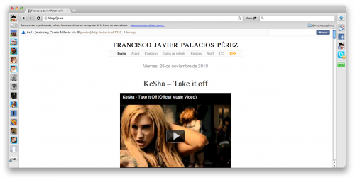

  
click en la imagen para ampliar

Conocí [RockMelt](http://www.rockmelt.com) gracias a @alvaroprb. En su blog hizo mención a este [nuevo navegador social](http://www.savethegeek.es/internet/rockmelt-un-navegador-muy-social/) y aunque leí el artículo tarde, me entró la curiosidad. Es bastante difícil que abandone Firefox por cualquier otro navegador (Safari, Chrome, Opera, Internet Explorer...), pero no obstante siempre que sale algo nuevo, igualmente lo pruebo. Y este es bastante interesante, aunque siga prefiriendo mi Firefox. :)

Como veréis en la imagen, **la forma de utilizar RockMelt es exactamente la misma a la de usar Google Chrome**. De hecho, RockMelt es _un fork_ social de Google Chrome (para Mac y Windows). Sobre todo, **enfocado a interactuar con Facebook y Twitter sin necesidad de disponer de un cliente externo o de entrar a su página web**.

### Barra lateral izquierda

**Esta barra es la que contiene todo lo relacionado con Facebook**, su principal propósito, ya que desde que inicias te pide que te identifiques con tu cuenta de Facebook. El primer icono de arriba del todo es el propio, de quien utiliza la cuenta. Justo debajo vemos un selector, desde donde podremos elegir qué amigos se ven justo debajo. La opción que tengo marcada en la imagen es la de visualizar todos (van situándose por encima quienes están conectados al chat), pero hay una opción de _favoritos_, desde donde podremos elegir mostrar una lista personalizada de amigos, de entre todos los que disponemos en Facebook.

### Barra lateral derecha

**Esta es la parte donde se van agrupado las fuentes RSS que vayamos agregando**. En la imagen podemos ver, arriba del todo, mi **Google Reader**; haciendo click en el botón podremos ver las fuentes que tenemos en nuestro _lector de feeds_ y poder ir leyendo todas las que no estén leídas. Justo debajo está la **actividad reciente de Facebook**, que serían todas las cosas que nos salen en la pantalla de inicio de Facebook. El siguiente icono que tengo es el de **mi perfil de Facebook**, irán saliendo todas las cosas que vayan apareciendo en el muro. Y por último, **Twitter**, desde donde tendremos la posibilidad de seguir el timeline, publicar nuevos tweets, hacer retweets, y en definitiva prácticamente todo lo que podrías hacer desde la propia página de Twitter. A esta lista puede ir añadiéndose cualquier fuente RSS que nos interese tener presente. Y como veis en la de Twitter, **cuando hay nuevos elementos va marcándolos sobre un rectángulo amarillo en su parte inferior derecha**.

Si instalamos el navegador en un Mac con Growl instalado, conforme vayan saliendo nuevas actualizaciones **también tenemos la opción de habilitar las notificaciones Growl** aparte de, como ya dije, que se vayan marcando dentro del propio icono de la barra lateral derecha.

### Botón Share

**Haciendo click en este botón podremos enviar la página que estemos visitando a Facebook o a Twitter**. En caso de enviarse a Twiiter, automáticamente acorta la dirección para que ocupe menos caracteres (quienes usáis Twitter ya sabéis de qué os hablo). En mi caso, dese Firefox para esto mismo utilizo unos bookmarklets, pero esto es sin duda mucho más práctico.

### Descarga RockMelt

Por el momento, Rockmelt está en fase beta. Una de las formas de descargarlo es yendo a [la página web de Rockmelt](http://www.rockmelt.com) y demandando una invitación. La forma de hacerlo es conectándote con tu cuenta de Facebook: un simple click. Como en mi caso, a los 3 ó 4 días recibiréis una invitación con una dirección desde donde poder descargar la versión de Mac o Windows.

La otra forma de conseguirlo es **mediante un sorteo que voy a hacer yo para los lectores del blog**. De entre todas las personas que comentéis solicitando una invitación (**aclarad si queréis la invitación en el comentario**), uno de ellos será el ganador. En caso de que simplemente se interese una persona, no hay mucha complicación; **en caso de ser varias las personas interesadas, mediante la página web [random.org](http://www.random.org/) saldrá al azar un número, y quien corresponda con ese número de comentario será quien se lleve la invitación**.

**El sorteo finalizará el miércoles día 1 de diciembre a las 23:59. Es decir, todos los comentarios que existan hasta esa fecha y hora participarán en el sorteo**. Y cuando haga el sorteo, como no puedo permitirme contratar a un notario, haré una captura de pantalla de la página web para que haya prueba de que ha sido completamente al azar.

**¡Suerte a todos!**

Dado el éxito, queda anulada la invitación.
