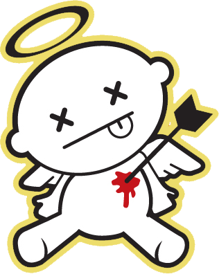

Sí joder, sí. Hoy es San Valentín. ¿Y sabéis lo que es una mierda? ¿seguro? Pues me importa menos que eso, que una mierda. A ver si consigo que ya nadie más me recuerde qué día es hoy, porque me la trae al pairo el día que sea. ¿Que qué día es? ¡DOMINGO! Es domingo. :D Dicho queda.
