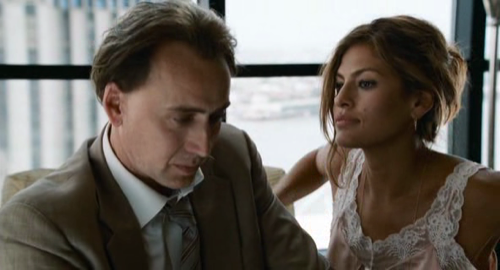

### Puntuación

**Intérpretes**

    

**Innovación**

    

**Reparto**

    

**Duración**

    

**Objetivo**

    

Tenía ganas de ver esta película, pero al final ha sido una de tantas de las que tenía más idealizado lo que debía ser, o lo que esperaba que fueran, que lo que realmente han sido. Es decir, la película no está mal, y seguramente será lo que su director haya querido que sea y no otra cosa, pero no es ni de lejos lo que yo me esperaba. La actuación de [Nicolas Cage](http://www.imdb.es/name/nm0000115/) (**Terence McDonagh**) es francamente buena, o al menos basándonos en su lista de interpretaciones normalmente bastante _alocadas_; al igual que la de [Eva Mendes](http://www.imdb.es/name/nm0578949/) (**Frankie Donnenfeld**). Pero no sé, me esperaba más chicha de esta película. Sobre todo, leyéndonos la sinopsis (que siempre leo antes de decidir si veo o no una película) y, en mayor medida, el título de la película.

Un resumen bastante fidedigno de la película es que se trata de un policía adicto a la coca, traficante, putero y corrupto que moviendo hilos por aquí y por allá logra pagar sus deudas de juego y apuestas y le suben el rango policial por ayudar a capturar la misma banda de traficantes con la que él hacía negocios. Fin.
