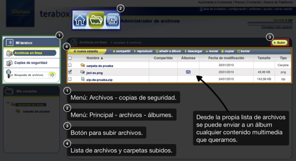

**Telefónica ha lanzado un nuevo servicio de almacenamiento**. Y cómo no, yo lo he probado. En su día probé [Dropbox](https://www.dropbox.com/) y, aunque no es un servicio que yo necesite (éste de Telefónica tampoco) lo vi bastante bien. A diferencia de **Dropbox**, como era de esperar aunque quería creer que no fuera así, **[Terabox](https://terabox.telefonica.net/) es únicamente para clientes de Telefónica**. Me explico, porque si no mi afirmación sería demasiado evidente. Lo que quiero decir con esto es que **a la hora de usarlo como almacén de archivos**, personales y para compartir, **no puedes compartirlos con nadie que no sea cliente de Telefónica**, ya que para su correcto funcionamiento solicita una dirección de correo electrónico del dominio telefonica.net y ésto, como sabréis, sólo lo tienen los clientes de Telefónica.

El servicio **ofrece 5GB de almacenamiento gratuitos** (para clientes de Telefónica) **ampliables a 50GB, 200GB ó 1TB**. Pagando una cuota mensual de 1,5€, 3€ ó 5€ respectivamente. Vamos a ver cómo es por dentro.

en el ejemplo, creada una carpeta, subida una fotografía y un archivo comprimido de prueba

Como veréis en la imagen, en el menú de la izquierda podemos seleccionar entre el almacén de archivos o la parte de copia de seguridad de tu ordenador. La parte del almacén de archivos es la que está en la propia imagen. En el caso de la copia de seguridad, viene a ser lo mismo que el almacén de archivos solo que, en esta parte, es donde se quedará todo lo que vayas salvando desde el programa que la propia Telefónica ofrece. **Es un programa que se instala en tu ordenador y permite transferir archivos a Terabox** para que estén a salvo en caso de que el disco duro de tu ordenador sufra algún daño. Y algo que me gustó mucho es que **existe tanto una versión compatible con Windows XP y Vista como otra con Mac OS X**.

**Opinión personal y resumen final:** para utilizarlo como copia de seguridad personal de tus archivos, de maravilla. Para utilizarlo para compartir archivos, casi que no. Por que sí, aunque hay bastante gente con Telefónica, no todos tienen Telefónica. Y siempre es mucho más fácil facilitar una dirección directa al archivo (como sucede en cualquier servicio de almacenamiento) para que se lo bajen que tener que entrar a tu cuenta de Telefónica y ver por dónde está el archivo que algún amigo quiera compartir contigo. Un poco rollazo, vamos.
