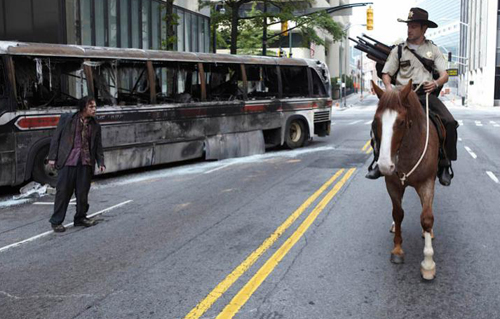

### Puntuación

**Intérpretes**

    

**Innovación**

    

**Reparto**

    

**Duración**

    

**Objetivo**

    

Para mí, y lo digo bien claro: la serie del año. Sin dudarlo además. **The walking dead** me parece una maravilla de la que estoy esperando la segunda temporada _como agua de mayo_. No soy un _seriéfilo_ empedernido, aunque últimamente esté enganchándome más, pero bajo mi desconocimiento en la materia creo que tiene algo que no se ve muy frecuentemente: cada capítulo de la primera temporada, al menos, está rodado por un director diferente. Quizá sí haya ocurrido en más series, pero desde luego, no tengo constancia de que eso haya sucedido en ninguna de las que yo he seguido. Y me parece, cuanto menos, interesante. Siguiendo la misma trama, con los mismos personajes, y bajo el mismo escenario, cada director puede darle un rumbo inesperado para el que vaya a rodar el siguiente capítulo. Cada uno le da ese punto especial que cada uno tenemos a la hora de hacer las cosas; algo que, seguro, que si todos los capítulos los dirigiera la misma persona no se podría ver. Y eso a mí me gusta. Ya veremos si en la segunda parte (que según dicen constará de más episodios que la primera) ocurre lo mismo; quizá con tan sólo seis episodios haya sido _fácil_, pero con más pueda complicarse la historia, porque no sé yo si habrán tantos. :P

La serie está basada en una serie de cómics en blanco y negro que se empezaron a publicar en 2003. **El _leit motiv_ de la serie es un apocalipsis zombie mundial, bastante recurrente, cierto, pero enfocado de una forma especial**. A lo largo de la serie va centrándose en los distintos supervivientes que van quedando, en cómo conviven los unos con los otros, en cómo se unen los pocos que quedan, y de qué forma intentan combatir contra los zombies con esperanza de que quede más gente viva. Para quienes no les guste este tipo de películas o series quizá la vean como algo más del montón, pero para quienes nos gusta en mayor o menor medida, está muy bien.

El reparto principal consta de [Andrew Lincoln](http://www.imdb.es/name/nm0511088/) (**Rick Grimes**), [Jon Bernthal](http://www.imdb.es/name/nm1256532/) (**Shane Walsh**), [Sarah Wayne Callies](http://www.imdb.es/name/nm0915637/) (**Lori Grimes**), [Chandler Riggs](http://www.imdb.es/name/nm3385128/) (**Carl Grimes**), y un grupo de supervivientes que consta, entre otros, de [Steven Yeun](http://www.imdb.es/name/nm3081796/) (**Glenn**), [Lennie James](http://www.imdb.es/name/nm0416694/) (**Morgan Jones**), [Laurie Holden](http://www.imdb.es/name/nm0390229/) (**Andrea**), [Emma Bell](http://www.imdb.es/name/nm0068187/) (**Amy**), [Jeffrey DeMunn](http://www.imdb.es/name/nm0218810/) (**Dale Horwath**), [Norman Reedus](http://www.imdb.es/name/nm0005342/) (**Daryl Dixon**), [Michael Rooker](http://www.imdb.es/name/nm0740264/) (**Merle Dixon**), [IronE Singleton](http://www.imdb.es/name/nm1533036/) (**T-Dog**)...

Si no tenéis nada mejor que hacer, os recomiendo verla. Es muy interesante, y como la primera temporada no dura mas que seis capítulos (punto en contra, para mí que me encantaron), no se tarda demasiado de ver. **Yo, de hecho, volveré a verla**. Me gustó tanto que quiero repetir mientras espero a que salga la segunda temporada, que ya se espera para 2011. Así que tampoco habrá que esperar tanto.

**Si la habéis visto, espero vuestras opiniones; si no, dádmelas cuando la veáis, a ver qué os pareció.** :D
