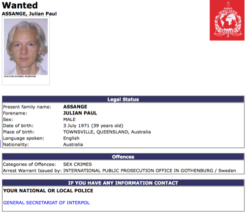
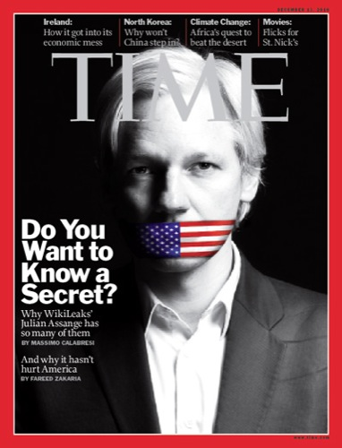

Si a estas alturas nombro **WikiLeaks** seguro que no es una novedad para nadie. O al menos, para muy pocos, que todavía queda gente que no sabe qué significa esto. Pero con la trascendencia que últimamente se le está dando, como dije, cada vez son menos.

¿Todos conocemos la Wikipedia, no? La plataforma que se utiliza para WikiLeaks es la misma, lo único es que aquí no encontrarás material enciclopédico, lo que encontrarás serán **noticias sin adulterar, sin pasar por el filtro que hace que la misma noticia depende de quién pueda contarla deje ver que ha pasado una cosa u otra**. Estas noticias son obtenidas de fuentes confidenciales o de alto secreto, de personas anónimas, que han podido estar metidos como soldados, operarios, secretarios, etc, dentro de todo esto que poco a poco se va destapando y que, por el motivo que cada uno tenga, quieren que el mundo sepa su versión de lo ocurrido, que no sería mas que la versión real, pero que al público general se nos oculta. Es [la mayor filtración de información confidencial de la historia](http://www.elpais.com/articulo/internacional/mayor/filtracion/historia/deja/descubierto/secretos/politica/exterior/EE/UU/elpepuint/20101128elpepuint_25/Tes).

### Intento de desprestigio y silencio

Cuando una persona habla, y no te gusta lo que dice, lo más común es **intentar callarla**; si no resulta, **hay que desprestigiarla** para intentar que nadie crea lo que dice. Y si en lugar de una persona, es una organización como en el caso de WikiLeaks, lo mejor es ir a la caza de su cabeza más visible para intentar, al menos, desestabilizar. Y **es lo que han estado haciendo** todo este tiempo desde Estados Unidos, con la ayuda de la Interpol.

El intento de desprestigio más grande que se ha intentado contra él, **Julian Assange**, y por lo que está en busca y captura tanto por la policía sueca como por la Interpol, a diferencia de lo que muchos creen **no es una violación** si no algo por lo que en la mayoría de países la policía ni se molestaría en buscarle: **mantener relaciones sexuales con otra persona sin el uso de preservativo**. En su momento, esta persona accedió a ello, de forma consentida por tanto no es ningún _delito_; más tarde, **se desconoce por qué motivos**, esta persona cambió de opinión.

Pese a todo, **no han conseguido callar a WikiLeaks**. En la actualidad **wikileaks.org** es inaccesible (es el primer dominio, con el que se dio a conocer la asociación), pero intentar poner barreras a internet es como intentar poner diques al mar. Es cierto que **wikileaks.org** no existe, pero **WikiLeaks sigue existiendo para todo aquel que sepa cómo encontrar la página**: en estos momentos, las formas de acceder a WikiLeaks son estas: [WikiLeaks](http://wikileaks.ch), [WikiLeaks](http://46.59.1.2), [Wikileaks](http://213.251.145.96); la mejor forma de estar al tanto de los cambios que van habiendo son por los hashtags activos en Twitter #wikileaks y #savewikileaks, y si lo que quieres es información oficial de primera mano, el usuario en Twitter es @wikileaks y su página en Facebook es [WikiLeaks](http://www.facebook.com/wikileaks).

### Un antes y un después

En la época en la que nos encontramos, en la que en internet se puede encontrar prácticamente de todo, llámese como quiera que se hubiese llamado **la aparición de un WikiLeaks era necesaria e inevitable**. Vivimos en un mundo en el que sólo nos enteramos de lo que a las distintas personas de poder les interesa que nos enteremos, tal y como quieren que nos enteremos, y en el momento preciso en el que debamos enterarnos; enmascarando todo aquello que se supone que no debemos saber, silenciando a aquellas personas que quieran que nos enteremos. Y **eso no se puede ni debe permitirse**.

**El objetivo principal de WikiLeaks se ha completado** ya: nos **han demostrado que sólo se necesita un medio en el que las personas que quieran puedan contar lo que saben**; por sí solas quizá no lo harían, pero sólo hay que darles un empujón. Tarde o temprano capturarán a Julian Assange de donde quiera que se encuentre, perderá él su libertad, y probablemente también lo hagan todos los que le hayan ayudado a que WikiLeaks sea lo que hoy en día es, o gran parte de ellos si es que los encuentran, pero el _efecto WikiLeaks_ sin duda ha causando un antes y un después; podrán ir contra un individuo, pero como en innumerables ocasiones ha sucedido, **esto va a dar pie a que nazcan otros Wikileaks en más países, incluso estados o provincias**. Internet es un arma imparable a la que hoy en día prácticamente todos tenemos acceso, y en la que se ha demostrado que, por más que quieran, no van a poder detener al colectivo. Que internet es un medio desde el cual todo el mundo va a descubrir quiénes son y cómo son las personas con poder en este mundo... y que quizá muy pronto se les acabe el juego. Lo próximo qué será, ¿querer cerrar Twitter?

**Ninguno de nosotros podemos ni siquiera imaginarnos remotamente el miedo que tienen que estar pasando.**
