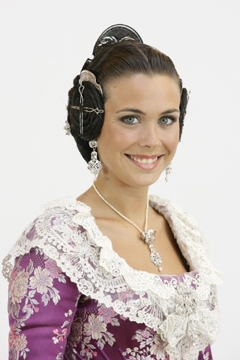
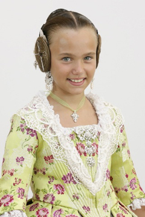
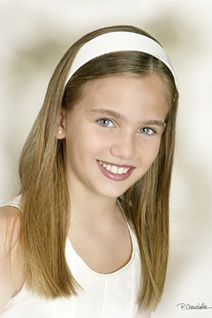

Pues sí, las Falleras Mayores de 2011 ya han recibido la llamada de la Alcaldesa de Valencia, Rita Barberá, y hemos podido verlas y escuchar sus primeras palabras desde las cámaras del ente autonómico. Sin más preámbulos, aquí podréis verlas:

  
**Fallera Mayor de Valencia 2011**

Preciosa, por cierto, la Fallera Mayor de Valencia 2011 se llama **Laura Caballero Molina**, tiene 23 años; de la Falla Carrera Malilla-Ingeniero Joaquín Benlloch, sector Cuatre Carreres; estudiante de Magisterio de Educación Infantil y diplomada en Fisioterapia.

  
**Fallera Mayor Infantil de Valencia 2011**

Inexpresiva y habladora, aunque tímida, se mostraba **Carmen Monzonís Valero**, la Fallera Mayor Infantil de Valencia 2011, de 9 años. Pertenece a la Falla Alameda-Avenida de Francia, del sector Camins al Grau. Estudia en el colegio Iale de l'Eliana.

Ninguna de las dos Falleras Mayores habla valenciano, y como quienes me conocéis sabéis, me parece poco ético. Pero bueno, al menos me consuela saber que algunas de las veinticuato de la Corte de Honor de cada una de ellas sí lo hablan, y bien además. Algo es algo, todo no podía ser perfecto.

Y bajo ningún concepto olvidarnos de sus Cortes de Honor, que junto con ellas dos pasarán un año fantástico en compañía de todos los falleros y valencianos en general. Aquí están los nombres de las veinticuatro afortunadas:

**Corte de honor de la Fallera Mayor:** Paula Civera Moreno, Amparo Bresó Sapena, Tania Porta García, Paula Sánchez Torondel, Pilar Morillas Torresano, Rut Sánchez Casamayor, Sandra Polop Navarro, Beatriz Pons Mínguez, Susana Gavilá Nácher, Natalia Molins Giner, Paula Díaz Mas y Arantxa Escudero Asensi.

**Corte de honor de la Fallera Mayor Infantil:** Carla Ruiz Vilalta, María San Miguel García, Carla Huete Pérez, Inés Plaza Soriano, Alicia Sofía Blanco i Carbonell, Mireia Navarro Diana, Akzara Moya Pérez, Blanca Hernández Rius, Sara Sancho Genovés, Marina Ruiz Ventura, Mª Estela Arlandis Ferrando y Alba Tolosa Palacios.

Desde aquí **os deseo a las veintiséis que paséis un año inolvidable y que disfrutéis un montón**. Y de nuevo reivindicar que [a los chicos también nos gustaría tener la opción de pasar por algo así](http://fjp.es/quiero-ser-presidente-infantil-de-valencia/). Me parecería, cuanto menos, justo.
