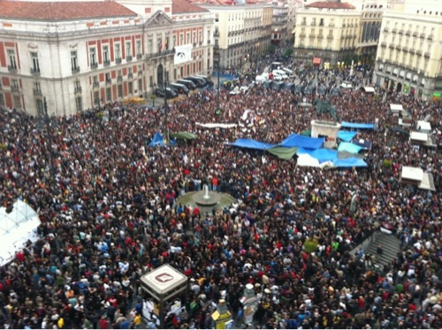

Lo que empezó siendo una manifestación a la que —personalmente— pensaba que no acudiría prácticamente nadie, de la cual los medios tradicionales —prensa y televisión— ni siquiera se harían eco, resultó ser una manifestación con un montón de gente a la que, en principio, se empeñaron la mayoría de medios en taparla, ocultarla, desviar la atención, intentar que no se conociera la magnitud real de la noticia... Pero que el _[efecto Streisand](http://es.wikipedia.org/wiki/Efecto_Streisand)_ que generó fue tan grande, que no ha habido forma humana de hacer que los españoles no supiéramos la realidad del asunto. Pese a lo mucho que a más de uno les hubiera gustado.

La imagen que hay sobre estas líneas es una vista, desde una altura considerable, de la Puerta del Sol y alrededores. **Sí, todo eso que parecen hormigas, son personas**. Está tomada el día 18 de mayo, en una de las concentraciones que desde el día 15 se han venido haciendo en la famosa plaza de Madrid. No suelo utilizar fotos tan altas, porque estéticamente no me gustan demasiado, pero recortándola no se apreciaría en su totalidad la gente que había, que es su cometido.

No contentos con todo esto, que claramente entorpece y perjudica sus campañas electorales, **los partidos IU y PSOE se han querido adjudicar unos puntos con esto, tomándolo como una iniciativa propia, cuando está claro que no lo es**. Haciendo pública al mundo su incompetencia e ignorancia —porque claramente no han entendido absolutamente nada— y haciéndonos cuestionar —más aún— si alguno de ellos, aunque sabíamos que para la política no servían, si realmente servirán para algo productivo en esta vida. Para que sepamos que nada de todo esto es cierto, y que lo único que pretenden es manipular y despistar, este es el manifiesto que ha realizado la organización, votado democráticamente.

> ### ¿Quiénes somos?
> 
> Somos personas que hemos venido libre y voluntariamente, que después de la manifestación decidimos reunirnos para seguir reivindicando la dignidad y la conciencia política y social.
> 
> No representamos a ningún partido ni asociación. Nos une una vocación de cambio. Estamos aquí por dignidad y por solidaridad con los que no pueden estar aquí.
> 
> ### ¿Por qué estamos aquí?
> 
> Estamos aquí porque queremos una sociedad nueva que dé prioridad a la vida por encima de los intereses económicos y políticos. Abogamos por un cambio en la sociedad y en la conciencia social. Demostrar que la sociedad no se ha dormido y que seguiremos luchando por lo que nos merecemos mediante la vía pacífica.
> 
> Apoyamos a los compañeros que detuvieron tras la manifestación, y pedimos su puesta en libertad sin cargos.
> 
> Lo queremos todo, lo queremos ahora, si estás de acuerdo con nosotros: ¡ÚNETE!

Todos los que nos hemos informado un poco sobre todo esto tenemos claro que van/vamos **en contra de este sistema político, en contra de cómo se toman esta democracia que sólo favorece unos pocos adinerados, en contra de unas votaciones que no nos permiten elegir si no optar entre algo malo y algo peor, en contra de los banqueros que nos han metido en esta crisis** —que aunque sea mundial, en España vamos sobrados de ella— **y que pese a contar con ayudas** —ayudas para nosotros, no nos olvidemos— **han preferido quedárselas ellos y enriquecerse aún más**. En contra de toda esta lacra desfasada, que mira más por intereses propios que por los nuestros. Cuando la política debería servir al ciudadano, al pueblo, y no ser nosotros quienes les sirvamos a ellos.

> No somos anti sistema, el sistema es anti nosotros Puerta del Sol, Madrid

Lo mejor de todo es que no solamente nos hemos enterado los españoles, fuera de España también es noticia —afortunadamente— lo que ocurre aquí. Hasta [fue noticia en el Washington Post](http://www.washingtonpost.com/business/tens-of-thousands-march-in-spain-to-protest-against-austerity-measures-banks-politicians/2011/05/15/AF13OH4G_story.html). Y no sólo eso, si no que también —desconozco si hay más—, **se han preparado manifestaciones en ciudades como Londres, Birmingham, París o Berlín. Y en países como Argentina o México, aunque no sé concretamente dónde**.

Pese a que los medios se empeñan en hacernos creer que son iniciativas encubiertas de políticos de partidos de la izquierda, sabemos que no es así. No digo que no hayan ciudadanos en esas manifestaciones que sean de izquierdas, de derechas o apolíticos, pero todos estamos juntos por un bien común: nuestro bien, el del pueblo. Por un bien que radicaría, fácilmente, en el ejemplo que nos han puesto en Islandia: banqueros y políticos a la cárcel y que paguen la deuda quienes la generaron. Y **a partir de entonces, que se cuente con nosotros para las decisiones más trascendentales**; que podamos opinar de verdad. No, como ya dije, optar solamente entre algo malo y algo peor.

+info: [tomalaplaza.net](http://tomalaplaza.net/), @acampadasol, #acampadasol, #spanishrevolution o [Spanish Revolution](http://www.facebook.com/SpanishRevolution).
