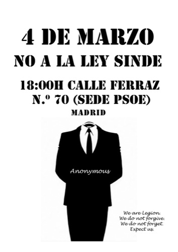

Me informa @alexmaquero de esta manifestación que **tendrá lugar, a las 18:00, el 4 de marzo frente a las puertas de la sede del PSOE en la C/ Ferraz, 70, de Madrid**. Puede que vayan sumándose más ciudades, pero por el momento tengo constancia solamente de Madrid. He de dejar claro, tal cual me ha dicho, que se trata de **una manifestación pacífica**, en la que se llevarán carteles expresando nuestra disconformidad hacia la #LeySinde y nuestra animadversión hacia todos los políticos que, con sus votos, han permitido esta ley inconstitucional, esta mordaza digital. También podéis llevar las máscaras que han empleado los Anonymous para reivindicarse. Si no tenéis una, también [podéis imprimir y crear vuestra propia máscara de V de Vendetta](http://hotfile.com/dl/39215539/a391679/guyfawkesmask.zip.html). Lleva su trabajo, pero el resultado es bastante aceptable.

**Actualizado:** Barcelona también se suma a la manifestación pacífica. Si quieres asistir, igualmente **será a las 18:00, en la sede del PSOE de la C/ Anselm Clavé, 65**.
