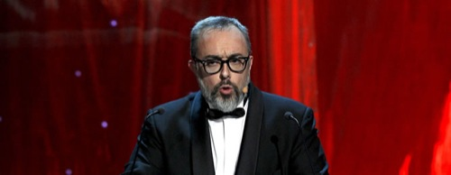

Los que venimos siguiendo a Álex de la Iglesia en Twitter (@AlexDeLaIglesia) desde que empezó todo este embrollo de la #LeySinde **sabíamos cómo iba a reaccionar llegado este día**, el día en el que **ha participado en la Gala de los Goya como Presidente de la Academia de Cine por última vez**. Como sabéis, tras dimitir públicamente a través de Twitter **debido al escándalo, a las discrepancias y a todo el sinsentido de esta ley totalitaria, anti democrática y, sobre todo, inconstitucional**. Sabíamos que hoy nos íbamos a divertir cuando le escucháramos, pero afirmo y creo que no me equivoco, **ni nuestros pensamientos más optimistas se rozaban siquiera la sombra de lo que realmente ha sido este discurso**, para la historia. Ha sido, claramente, **la voz del pueblo español en una gala a la que no podemos tener acceso**. Ha sido quien, afortunadamente, **ha impuesto la parte de cordura que debía tener la gala**. Y también, por qué no decirlo, seguramente **el más perjudicado de todos los que allí se daban lugar, pese a ir con la verdad por delante**. Sea como sea, **ojalá le vaya bonito en lo que a partir de ahora le depare**.

Como internet es compartir, y pese a que en YouTube vayan eliminando todos los vídeos que se suben con el discurso de esta persona a la que, desde hoy, ya considero uno de mis ídolos, [os dejo un «regalito» en Megavideo que seguro os gustará](http://www.megavideo.com/?v=PFV8APXG) y seguro que nadie lo quita. ;)

Y para que quede _in memoriam_, **quiero hacer una transcripción del guión de Álex de la Iglesia en la Gala de los Goya de 2011**. No sin antes, darle las gracias a [algún becario de El País](http://www.elpais.com/articulo/cultura/Discurso/integro/Alex/Iglesia/entrega/Goya/elpepucul/20110213elpepucul_9/Tes) que se ha tomado la molestia de transcribirlo por mí. Y dice así:

Buenas noches:

El día de hoy ha llegado porque hace 25 años, doce profesionales de nuestro cine, en medio de una crisis tan grave como la nuestra, caminaron juntos a pesar de sus diferencias. Quiero empezar este discurso felicitando a los fundadores de la Academia.

No sólo ellos, sino todos los que me han precedido en esta institución, vicepresidentes, miembros de las juntas directivas y el conjunto de los académicos, nos han traído esta noche aquí, al Teatro Real, para celebrar el 25º aniversario de la Academia de las Artes y las Ciencias Cinematográficas y la existencia misma de los premios Goya. A todos, muchísimas gracias.

Puede parecer que llegamos a este día separados, con puntos de vista diferentes en temas fundamentales. Es el resultado de la lucha de cada uno por sus convicciones. Y nada más. Porque en realidad, todos estamos en lo mismo, que es la defensa del cine. Quiero por ello felicitar y agradecer a todos los que estáis aquí, por caminar juntos en la diferencia, y hasta en la divergencia.

Hacemos mucho ruido, pero es que esta vez, hay muchas nueces. El choque de posturas es siempre aparatoso y tras él surge una nube de humo que impide ver con claridad. Pero la discusión no es en vano, no es frívola y no es precipitada.

No podemos olvidar lo más importante, el meollo del asunto. **Somos parte de un Todo y no somos nadie sin ese Todo. Una película no es película hasta que alguien se sienta delante y la ve. La esencia del cine se define por dos conceptos: una pantalla, y una gente que la disfruta. Sin público esto no tiene sentido. No podemos olvidar eso jamás**.

> Una película no es película hasta que alguien se sienta delante y la ve. La esencia del cine se define por dos conceptos: una pantalla, y una gente que la disfruta. Sin público esto no tiene sentido.

Dicen que he provocado una crisis. Crisis, en griego, significa "cambio". Y el cambio es acción. **Estamos en un punto de no retorno y es el momento de actuar. No hay marcha atrás. De las decisiones que se tomen ahora dependerá todo. Nada de lo que valía antes, vale ya. Las reglas del juego han cambiado**.

**Hace 25 años, quienes se dedicaban a nuestro oficio jamás hubieran imaginado que algo llamado internet revolucionaría el mercado del cine de esta forma y que el que se vieran o no nuestras películas no iba a ser sólo cuestión de llevar al público a las salas**.

**Internet no es el futuro, como algunos creen. Internet es el presente. Internet es la manera de comunicarse, de compartir información, entretenimiento y cultura que utilizan cientos de millones de personas. Internet es parte de nuestras vidas y la nueva ventana que nos abre la mente al mundo. A los internautas no les gusta que les llamen así. Ellos son ciudadanos, son sencillamente gente, son nuestro público**.

> A los internautas no les gusta que les llamen así. Ellos son ciudadanos, son sencillamente gente, son nuestro público.

Ese público que hemos perdido, no va al cine porque está delante de una pantalla de ordenador. Quiero decir claramente que **no tenemos miedo a internet, porque internet es, precisamente, la salvación de nuestro cine**.

**Sólo ganaremos al futuro si somos nosotros los que cambiamos, los que innovamos, adelantándonos con propuestas imaginativas, creativas, aportando un nuevo modelo de mercado que tenga en cuenta a todos los implicados: Autores, productores, distribuidores, exhibidores, páginas web, servidores, y usuarios**. Se necesita una crisis, un cambio, para poder avanzar hacia un nueva manera de entender el negocio del cine.

**Tenemos que pensar en nuestros derechos, por supuesto, pero no olvidar nunca nuestras obligaciones**. Tenemos una responsabilidad moral para con el público. No se nos puede olvidar algo esencial: **hacemos cine porque los ciudadanos nos permiten hacerlo, y les debemos respeto, y agradecimiento**.

Las películas de las que hablamos esta noche son la prueba de que en este país nos dejamos la piel trabajando. Sin embargo, el mismo esfuerzo o mayor hicieron tantas otras películas que nos han llegado a los sobres de las candidaturas. Ellos también se merecen estar aquí, porque han trabajado igual de duro que nosotros.

Quiero despedirme en mi última gala como presidente, recordando a todos los candidatos a los Goya tan sólo una cosa: qué más da ganar o perder si podemos hacer cine, trabajar en lo que más nos gusta. No hay nada mejor que sentirse libre creando, y compartir esa alegría con los demás. Somos cineastas, contamos historias, creamos mundos para que el espectador viva en ellos. **Somos más de 30.000 personas que tienen la inmensa suerte de vivir fabricando sueños. Tenemos que estar a la altura del privilegio que la sociedad nos ofrece**.

**Yo creo, con toda humildad, que si queremos que nos respeten, hay que respetar primero**.

> Si queremos que nos respeten, hay que respetar primero.

Y por último, me gustaría contarle algo al próximo Presidente de la academia, que ya me cae bien, sea quien sea: estos han sido los dos años más felices de mi vida. He conocido gente maravillosa de todos los sectores de la industria. He visto los problemas desde puntos de vista nuevos para mí, lo que me ha enriquecido y me ha hecho mejor de lo que era. He comprobado que trabajar para los demás es una experiencia extraordinaria por muy duro que resulte en un principio, y sobre todo: han pasado 25 años muy buenos, pero nos quedan muchos más, y seguro que serán mejores.

Buenas noches.
