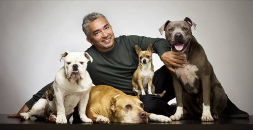

**No creo que haya nadie**, al menos nadie que ame a los animales, **que no conozca a [César Millán](http://www.cesarsway.com/espanol)**. O **más conocido como «_el encantador de perros_»**. Lo sigo desde hace tiempo, y **me gusta porque en muchos casos hace fácil lo que _per se_ parecería imposible**. Han salido muchos otros adiestradores de perros en televisión, con un formato muy similar al de César, pero el problema es ese mismo: **no son César Millán**.

**Tuve la grata sorpresa de enterarme que este pasado sábado saldría en La Noria —Telecinco—, donde iba a ser entrevistado por Jordi González y su séquito**. No suelo ver ese programa, salvo contadas excepciones, normalmente mientras ceno y no hay otra cosa que ver. Pero **como salía César, decidí ver la entrevista que le hicieron**. Lo bueno que saco de ella es que **va a estrenar próximamente un programa**, que probablemente se emitirá en Cuatro, **con un formato similar al que tan popular la ha hecho en el mundo, pero en España, para españoles y en español**. Justo lo que todos estábamos esperando.

https://www.youtube.com/watch?v=0YW-BNvHPY0

**El vídeo que aparece sobre estas líneas contiene la entrevista íntegra que en La Noria se le hizo a César**, para quien no lo haya visto. No he encontrado ningún otro vídeo que contenga toda la entrevista íntegra, por lo que no he tenido tampoco posibilidad de elegir. Éste tiene una marca de agua en el centro, bastante molesta dicho sea de paso, pero exceptuando eso, está bien.

Quiero hablar sobre la entrevista, porque si bien **en este caso la única culpa que se le puede echar a Jordi González es de no saber adiestrar a sus colaboradores**, como César hace con los perros, **se deberían haber tomado medidas para que algunas cosas que se dijeron en la entrevista no se hubieran dicho**. Sobre todo, las intervenciones de Jimmy Giménez-Arnau, que realizó un espectáculo bochornoso. Nada más empezar la entrevista se le preguntó de qué forma salió de México y entró en Estados Unidos; por sí misma no es una pregunta oportuna, pero tampoco tiene nada más allá. Él mismo reconoció que _brincó_, ante lo cual, aunque lo pienses, **si quieres hacer una entrevista serie no puedes preguntarle si fue considerado un _espalda mojada_**. Está de más. Más tarde se le preguntó qué pensaba sobre la zoofilia, poniéndole de ejemplo unas películas las cuales Jimmy parecía conocer a la perfección. Y en fin, **una cantidad de tonterías inconcebibles**. Supongo que, en parte, César sabría a lo que iba, sabría más o menos las preguntas que le iban a hacer, pero no creo que las conociera todas porque, **a veces, la cara de César era un poema**. Aunque Telecinco venda este tipo de espectáculo, **hay que ser conscientes de quién es quien está siendo entrevistado**. Que me perdonen, pero **César Millán no es alguien como María Antonia Iglesias, que por tal de sacarse unos euros en cada programa, va a hacer el ridículo si es necesario**.

Por Twitter además había gente que respondía a los que nos quejábamos de parte del trato que se le estaba dando. Y repito, **casi todas las quejas iban sobre muchos de los comentarios que vertió Jimmy Giménez-Arnau**. Nos decían si creíamos que César Millán era Dios, como para que se le tuviera que tratar correctamente, o de otra forma. Y no pueden mas que dejarme perplejo esas cuestiones. **¿Desde cuándo se necesita ser Dios para que te respeten?** El respeto es algo que se le debe a todo el mundo, tal como nos gusta que nos lo tengan a nosotros mismos. Y **si quieres respetar a alguien no puedes llamarle _espalda mojada_ a los tres minutos de dar comienzo a una entrevista**.

En fin, **que hay gente de todo tipo, lo sabía**. **Pero que había gente que cuestionaba si tener o no respeto por alguien**... **¿Qué opináis vosotros de todo esto? ¿Y de la entrevista?**
