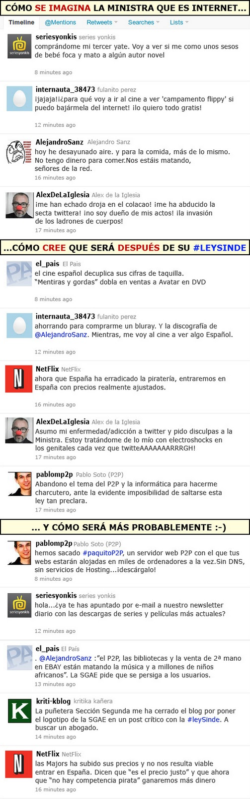

  
vía [Sinergía sin control](http://sinergiasincontrol.blogspot.com/2011/01/190-como-ve-sinde-internet.html)

Sinceramente, me parece genial. Y como dije en más de una ocasión, no se pueden poner diques al mar. O se ponen las pilas en poner un precio real a la calidad del producto final, o seguiremos obteniendo de la misma forma los contenidos multimedia que desde hace años venimos obteniendo sin mayores problemas, pese a los vanos intentos que han querido ir poniéndonos para evitarlo.

Política, la corrupción legal del siglo XXI.
