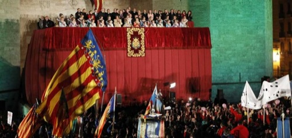

valencians, ¡ya estem en falles!

Encara que açò hauria d'haver-se publicat ahir, no va poder ser perque a Telefónica li va paréixer molt graciós deixar-me des de les sis de la vesprada fins a hui sense conexió a internet. Al marge d'açò, i pese a que no sol ser habitual que yo escriga ací en llengua valenciana, **hui vullc fer-ho, perque m'ix aixina**. Lo que vinc a comentar del dia d'ahir **és un acte molt emotiu per tot lo que representa per a un faller i podria dir que també per a quasi qualsevol valencià**. Yo per temes diversos que tampoc be a conte contar ara, ya no soc faller, **pero el meu esperit sí continua sent-ho**. Continue vivint les falles encara que ya no siga com abans. I sobre tot, **continue pensant lo mateix que milers de persones més: les falles son la millor festa del món sancer**.

Ahir, dia 27 de febrer, últim dumenge del mes, i com cada any, toca l'acte protocolari més esperat de tots, en el qual tota la festa comença: **la cridà**. Que ya ficat en l'assunt, i aprofitant que ho dic, per a pronunciar la paraula n'hi ha que fixar-se en la tilde que porta l'única «a» de la paraula. Cal dir «**cridÀ**», no «cr/í/da». **Portem tota la vida dient-ho be i ara per ser més guais hem de canviar-ho**...

Be, i quan l'acte termina, és un orgull per a tots els que sentim les falles reconéixer i dir: **VALENCIANS, ¡YA ESTEM EN FALLES!** I es que en el dia d'ahir va escomençar tot: **la primera despertà, la primera chocolatà, els primers sons interpretats per milers de músics tocant al mateix temps el nostre himne regional, la primera mascletà, la primera volta que podem vore a les nostres Falleres Majors en les seues millors gales, en acte festiu oficial de falles, el primer castell**... i la primera volta de l'any que més de **cinquanta mil persona ixen al carrer en les seues senyeres, en les seues bandes de música, en els seus estandarts, i en tota la seua ilusió per vore a les nostres representats, i en totes les seues ganes de festa i d'emoció de vore que lo que tant de temps portem esperant ya està ahí**.

En quant a la retransmissió per la televisió pública dels valencians vullc dir que és la primera volta que s'enrecorden dels que per un motiu o atre no podem estar als peus de les Torres de Serrans, vent-ho. Ni tampoc podíem vore el castell que culmina l'acte. En antres anys recorde que només terminar de parlar la Fallera Major, tallaven l'emissió. I enguany hem pogut vore sancer el castell que se va llançar. No m'ho esperava, i va agradar-me molt.

En lo que respecta a la cridà, **va agradar-me escoltar a la nostra alcaldesa Rita Barberá parlant la llengua de tot el poble valencià**, i perfectament parlada. I m'alegra perque és cert que encara que sàpia parlar-la, no ho fa pràcticament mai. **Ixcà siga atra estratègia política de cara a les eleccions**, com ho va ser [tallar la retransmissió de la televisió catalana](http://fjp.es/adios-tv3-adios-y-no-vuelvas/), pero siga com siga, el gest és bonico. Laura Caballero va fer un discurs molt emotiu, que me va agradar molt, i excepte unes poquetes errades en català, pròpies i normals per la pressió en l'escola en este aspecte, també va estar molt encertada en les seues paraules, en perfecte valencià, enrecordant-se de tots, i en definitiva, fent-nos passar un moment maravellós.

**El pròxim dimarts escomencen les mascletaes oficials**, i en elles, també eixiran al carrer i, sobre tot, per internet, les protestes dels **antisocials que no poden vore com la gent normal s'alegra, s'emociona i s'ho passa be per alguna cosa**. Eixos als que ara els dona per donar faena al jujats ficant denúncies a tot lo que pensen que pot ser digne de ser denunciat, mentres que atres, intentarem passar-nos-lo de la millor forma possible. Eixos que, en un setanta per cent, **des del dia u al dèneu de març acodixen a les 14:00 a la Plaça de l'Ajuntament a vore les mascletaes**; sí, **els mateixos que després critiquen les falles**. No passa res tampoc, en tota l'història de les falles ha segut aixina, **estem acostumats a viure en ells, pero ells no s'han pogut acostumar encara a viure una semaneta a l'any en mosatros**. I després **els intolerants som els fallers**...

**¡Vixquen les falles!**
