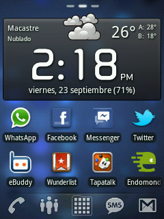
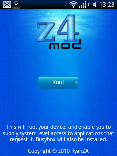
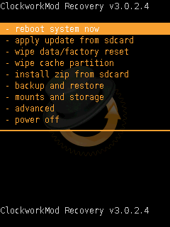

Todas las versiones posteriores al día 3 de febrero de 2012 se instalan desde un nuevo método, podéis seguir el tutorial para instalar [CyanogenMod en Vodafone 858 Smart (Huawei U8160) mediante ROM Manager](http://fjp.es/cyanogenmod-en-vodafone-858-smart-huawei-u8160-rom-manager/).

Lo primero que sentí al ver eso de los mods fue... curiosidad, supongo. Cuando llegué a ver CyanogenMod pensé: _¡coño, yo quiero eso!_ Y como dije anteriormente, en [mis primeros pasos con Android](http://fjp.es/mis-primeros-pasos-en-android/): ¿para qué conformarte con _una parte del pastel_ si te lo puedes comer entero, e incluso repetir?

CyanogenMod es una adaptación del sistema operativo Android, con **muchas más funciones, muchas más opciones de personalización y configuración, una serie de opciones que otorgan la máxima calidad y rendimiento posibles al hardware de tu teléfono**, y sobre todo en este modelo que nos ocupa, te permite hacer las cosas de forma mucho más fluida que con el firmware que viene _de serie_ en Vodafone. Por ejemplo, con el firmware que trae no es posible hacer uso de Google Street View —algo que me molestó mucho—... pero misteriosamente, con CyanogenMod ya se puede. Como dije, explota muchísimo mejor el hardware del teléfono, y lo que entonces provocaba un fallo y causaba que la aplicación se cerrara porque _no la soportaba_, ahora funciona sin ningún tipo de problema. Y como eso, lo demás.

### Qué necesitamos para instalar CyanogenMod

Lo primero: ganas, es fundamental. Debemos hacer unos cuantos pasos, perderemos todas las aplicaciones que tengamos instaladas en el teléfono y la configuración. Dejaremos el teléfono como si viniera de serie, pero con CyanogenMod instalado. Yo lo hice, y de verdad que merece la pena.

Cuando ya tenemos ganas de hacerlo, necesitaremos también descargar la app [z4root](http://www.mediafire.com/?x8136da80s2xg9y); el recovery [ClockWorkMod](http://www.androidworld.it/forum/modding-e-firmware-vodafone-smart-189/%5Bguide%5D-vodafone-858-smart-u8160-recovery-root-ed-altro-20081/#post172994); también una [versión modificada de ClockWorkMod](http://forum.xda-developers.com/showthread.php?p=17496969) para que funcione con CyanogenMod; descargar el port de [CyanogenMod para Vodafone 858 Smart](http://forum.xda-developers.com/showthread.php?t=1259739) y, opcionalmente, descargar el [último pack de aplicaciones de Google](http://wiki.cyanogenmod.com/index.php?title=Latest_Version/Google_Apps) **para CyanogenMod 7**. Esto último instala unas cuantas aplicaciones de Google, las cuales, si no las instalas de esa forma, puedes hacerlo manualmente después desde el Market. Simplemente ahorra algo de trabajo después.

**NOTA 1:** no enlazo a las versions existentes —salvo con la app z4root—, si no a la página índice de descarga de cada una de ellas, para que busquéis la versión más reciente que exista en el momento. Aseguraos bien que descargáis la última versión, e id echándole un ojo periódicamente a las páginas, porque van actualizándose con nuevas versiones. **NOTA 2:** Si utilizas Windows debes tener también instalados los drivers, si no los tienes: [descárgatelos aquí](http://www.dc-unlocker.com/test/Pulse_Drivers_xp_w7_w764.zip) —gracias, **Hohen**.

### Manos a la obra, instalemos CyanogenMod

La segunda parte es la que más complicación puede darnos, pero de verdad que es muy fácil; simplemente hay que conseguir que la aplicación que instala el recovery en nuestro teléfono nos lo detecte como conectado —es decir, que esté conectado al ordenador vía USB—, lo demás es tan sencillo que hasta lo hace sin que nosotros tengamos que hacer nada.

### Instalar z4root:

Con esta aplicación lo que vamos a hacer es _rootear_ nuestro Android. Para poder hacer todo lo demás, si no no sería posible. Cuando la tengamos descargada en nuestro ordenador, hay que pasarla al teléfono para instalarla. La forma más fácil es tener un lector de códigos QR —por ejemplo [Barcode Scanner](https://market.android.com/details?id=com.google.zxing.client.android)—, irnos a la página [APK Install](http://www.apkinstall.com/), subir el archivo y cuando nos salga el código con el lector de códigos lo leemos y comenzará a descargar nuestra app. Es muy sencillo. Una vez descargada, la instalamos y la ejecutamos.

La facilidad de manejo de esta app es pasmosa ya que cuando la ejecutemos únicamente tendremos un botón llamado **root**; lo pulsaremos, esperaremos un poco para que haga todo lo que tenga que hacer —en la parte inferior de la app va mostrándonos todo lo que va haciendo— y cuando termine el teléfono se reiniciará solo y ya tendremos nuestro Android _rooteado_. Para asegurarnos, en la lista de aplicaciones veremos una app que se llama _Superusuario_.

### Recovery ClockWorkMod _oficial_:

Ahora vamos a instalar ClockWorkMod. Para quien no sepa qué es un recovery, y explicado de un modo para que se entienda, es un menú que carga antes de iniciarse el teléfono donde tendremos unas cuantas acciones extra, que si no se instala, no existirían. Una de ellas sirve para instalar archivos que estén en la memoria externa.

Descomprimimos el archivo que hemos descargado y veremos ciertos archivos. Tres de ellos son para poder instalarlo en el teléfono desde los tres sistemas operativos que todos tenemos: Mac, Linux o Windows. En mi caso, obviamente, lo realicé desde Mac, pero el proceso es prácticamente idéntico para todos ellos. Os lo muestro:

- **En Mac** nos vamos al Terminal, navegamos al directorio donde tenemos descomprimida la carpeta, y justo ahí tecleamos estos dos comandos:
    
    chmod +x install-recovery-mac.sh
    ./install-recovery-mac.sh
    
- **En Linux** nos vamos al Terminal, navegamos al directorio donde tenemos descomprimida la carpeta, y justo ahí tecleamos estos dos comandos:
    
    chmod +x install-recovery-linux.sh
    ./install-recovery-linux.sh
    
- **En Windows** ejecutamos el archivo **install-recovery-windows.bat** y se nos abrirá una ventana de DOS.

Sea cual sea el caso, aparecerá una línea de espera hasta que detecte que nuestro terminal tiene conexión con el ordenador. Para que podamos controlarlo, la línea será esta: **< waiting for device >**. Apagamos el móvil, lo conectamos por USB al ordenador, precionamos la tecla de bajar volumen y **a la vez** la tecla de encendido; con esto, la aplicación en ejecución detectará el teléfono. Una vez detecte que el teléfono conectó, irán añadiéndose 3 ó 4 líneas por debajo de esa, indicando que el proceso va completándose. Cuando concluya el teléfono se reiniciará y tendremos el recovery instalado. Puede tardar un poco más en arrancarse, no os preocupéis que no pasa nada.

### Versión modificada de Recovery ClockWorkMod:

Una vez instalado Recovery ClockWorkMod la forma más fácil de instalar su _actualización_ es desde el propio recovery. Y para ello necesitamos que el archivo esté en la tarjeta externa. Conectamos el móvil por usb al ordenador, lo ponemos en modo transmisión de datos y en la raíz de la tarjeta externa colocamos el archivo modificado de ClockWorkMod que hemos descargado previamente. Y aunque ahora no lo necesitemos, podemos poner también el zip que contiene CyanogenMod y —recordemos que esto es opcional— si nos lo descargamos, también el paquete de aplicaciones de Google para CyanogenMod 7. Una vez hecho, salimos del modo transmisión de datos y desconectamos el móvil del usb.

Para entrar en el recovery tenemos que apagar el teléfono. estando apagado presionamos la tecla de subir volumen y **a la vez** el botón de encendido; sin soltarlos, esperamos hasta que nos aparezca un menú como el que acompaña la imagen de la derecha. Con las teclas de volumen +/- navegamos arriba/abajo por el menú, y con la tecla de encendido seleccionamos la opción. Navegamos hasta la opción que dice **install zip from sdcard**, de ahí nos vamos a la opción **choose from sdcard**. En este caso, y hasta que salga una nueva versión —básicamente, porque el nombre del archivo cambiará, con los números de la nueva versión—, seleccionamos el archivo **ClockworkMod-u8160-v0.1.zip** y le damos a instalar. Cuando termine, volvemos al menú y le damos a la última opción: **power off**, para apagar el teléfono.

### Instalando CyanogenMod

Volvemos a presionar la tecla de subir volumen y **a la vez** la de encendido, hasta que nos aparezca de nuevo el mismo menú de antes: del del RecoveryClockMod. Vuelvo a recordar que con las teclas de volumen +/- navegamos arriba/abajo por el menú, y con la tecla de encendido seleccionamos la opción. Nos ejecutamos las opciones **wipe data/factory reset** y **wipe cache partition** y dejamos que proceda. Con esto estaremos dejando el móvil sin nada, tal como vendría de fábrica —es esencial para que funcione bien.

Ahora vamos a hacer lo mismo de antes: **install zip from sdcard**, de ahí nos vamos a la opción **choose from sdcard**. En este caso, instalamos CyanogenMod, así que el archivo que tendremos que seleccionar para instalar es —recordemos que los números pueden variar dependiendo de la versión que se descargue, cuando vayan habiendo actualizaciones— **update-cm-7.1.0-RC1-u8160-v0.1-signed.zip**. Tradrará un poco, hasta que al final ponga que está completado. Una vez finalizado y si hemos optado por instalar también el paquete de aplicaciones de Google, es el momento de instalarlo. Haciendo de nuevo lo mismo que para instalar cualquier archivo zip de la tarjeta externa. Recordemos que si no hemos querido hacerlo no hay ningún problema, es opcional.

### Últimos pasos, ¡ya casi está!

Ahora volvemos de nuevo al menú y seleccionamos la primera opción: **reboot system now**. Se nos reiniciará el móvil y veremos el logo de carga de CyanogenMod. Tardará un rato en arrancar, no desesperéis y estad tranquilos, que tarda. Cuando arranque, aparecerá de nuevo la pantalla que apareció cuando compramos el móvil: seleccionar el idioma y la breve introducción, introducir una cuenta de Google, probar el teclado, etc. Ya sabéis. Y una vez hecho, tendremos nuestro flamante con CyanogenMod instalado. Seguro que cuando vayáis probando como funciona habrá merecido la pena hacer tantas cosas.

### Restaurar el teléfono de fábrica

Gracias a **Yokema**, en los comentarios, podemos conseguir una forma de restaurar el teléfono y dejarlo con el [firmware de fábrica de Vodafone](http://www.mediafire.com/?x8136da80s2xg9y). Dentro del archivo comprimido que se descarga viene un documento explicativo para saber cómo debemos proceder. **Personalmente no lo he probado, pero se supone que está facilitado por Huawei, así que debería funcionar**.

### Advertencia

**Quiero dejar claro que no me hago responsable de cualquier daño que se le pueda hacer al teléfono móvil mientras se sigue este tutorial**. También quiero dejar claro que **yo lo he hecho, que no me ha pasado nada, y que no tiene por qué pasar nada**. Es algo seguro, que cientos de personas hacen y no ocurre nunca nada. No tiene por qué. Pero ya sabéis.

**Espero que os haya servido de utilidad.**

Todas las versiones posteriores al día 3 de febrero de 2012 se instalan desde un nuevo método, podéis seguir el tutorial para instalar [CyanogenMod en Vodafone 858 Smart (Huawei U8160) mediante ROM Manager](http://fjp.es/cyanogenmod-en-vodafone-858-smart-huawei-u8160-rom-manager/).

\[ayuda\]
