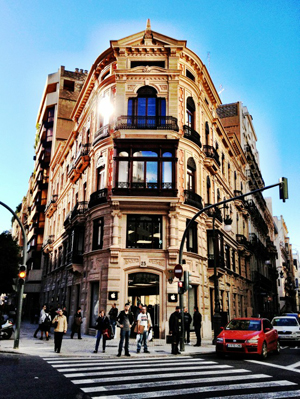

 Lo primero que quiero decir es que la Apple Store de Valencia me encanta. Pese a que no haya podido ir aún a verla... no imagináis cuánto lo deseo. Espero que este mes pueda acercarme en algún momento a verla. Con tiempo de sobra para toquetearlo todo bien. Y sobre este tema, decir que la [fotografía que acompaña estas líneas](http://twitter.com/josejacas/status/144397199911043073) es de @josejacas. Tal como él dice, está hecha con la app Camera+ —una aplicación fotográfica para iPhone. Y es que no hay mejor forma de retratar esta joyita que con un producto que la propia Apple haya fabricado.

Opiniones personales sobre la tienda aparte, entro con otro tipo de opiniones personales. Quería haberlo hecho hace tiempo, pero por un motivo u otro nunca lo hice; siempre fui procrastinando... hasta hoy. Que tuve un motivo claro para no dejar pasar más este tema. Hoy han llegado a la Apple Store de Colón —la de Valencia, para quien no lo sepa— los documentos para presentar quejas formales hacia Apple, por algún problema que se tenga en la tienda. Y **como era de esperar, con la cantidad de catalanistas que pululan por Twitter, es que empezaran a movilizarse para acudir en masa a poner quejas**. También irá gente que no viva siquiera en Valencia, como a las manifestaciones —véase caso Cabanyal. **Con tal de dar la nota, lo mismo da de dónde sea cada uno: lo que importa es poner quejas a mansalva**. Si la primera noticia de la existencia de que existe una compañía en el mundo llamada Apple la tuvieron porque hay una tienda en Valencia sin rotulaciones _en valenciano_ también da igual. La cuestión, como dije, es ir a poner una queja.

https://twitter.com/fjpalacios/status/145144814940323840

**Yo sería el primero que apoyaría toda esta mugrienta iniciativa si realmente promoviera el valenciano y no el catalán**. O la _unidad lingüística_ como lo llaman ellos, **para despistar a los incautos**. Desde el primer día que se abrió la Apple Store están con esto, son como chiquillos. Lo peor es que no entienden que Apple es una empresa privada. Y como tal, hará lo que le dé la gana. Quizá deberían plantearse mudarse de comunidad autónoma —aunque les pese, es lo que es— e irse a Cataluña, que **allí parece que con tanto radical si no rotulas en catalán te pegan fuego al chiringuito**. Allí estarían en su salsa.

https://twitter.com/fjpalacios/status/145162245666639873

Y aún es peor explicarlo de forma tan clara y concisa y que sigan sin entenderlo. ¿Lo bueno? Que **parece que Yolanda, la mánager de la Apple Store Colón** —no sé si habrán más—, **tiene un poco de conocimiento y sabe de qué palo va toda esta gente**. La mayoría de ellos, seguro que ni serán clientes de Apple, ni lo habrán sido, ni tendrán intención de serlo: **simplemente de dar por culo**. Hablando claro y rápido. Pero después nosotros no tenemos argumentos de peso... Pues oye, no sé cuántas toneladas pesaría el edificio de la Apple Store, pero en todo él no hay ni una sola palabra _en valenciano_. No sé si se merecerán más peso que ese... Eso sin hacer mención a la mala educación que tienen. **Dándoles igual si alguien se dirige a ellos en español: ellos siempre se dirigirán a ti en catalán**, lo entiendas o no. Seguro que sus padres de pequeños les dijeron que no debían hacer eso, pero la educación es libre y cada uno toma la que quiere.

https://twitter.com/Veromokhfi/status/145171660876693504

Cuando sienten que están haciendo el ridículo y que todo el mundo se ríe de ellos vienen con la siguiente tontería, a la cual están perfectamente adoctrinados. Aunque mal. **Estos tipos de respuestas están en su manual sobre cómo un adoctrinador catalán debe afrontar un día cualquiera en tierras extranjeras**. Pero no se dan cuenta que en todos los sitios, y todo el mundo, **no somos tan imbéciles como ellos**. Qué lástima. No se dan cuenta que hacen el ridículo allá donde van... pobres. Como ese último tweet lo leyera un castellano creo que no iba a estar muy de acuerdo con sus palabras.

**Para ellos el catalanismo es como una religión. De la cual poco saben, pero a ciegas creen en ello. Qué lástima**... ¿Por qué no se comprarán un bosque y se perderán en él?

P.D: entiéndase cuando pongo en cursiva _en valenciano_ ya que no lo es realmente. Es una burda estrategia más. Gracias.
