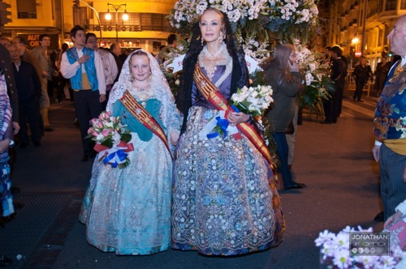

Para muchos, **la noticia de estas fallas 2011 ha sido que Carmen Lomana** (sobran las presentaciones), **haya sido Fallera Mayor de la falla Paseo de la Alameda-Avenida de Francia**. Los hay de los que, como en mi caso, **nos da igual quién sea Fallera Mayor de cada una de las comisiones**; los hay, aunque menos, de los que piensan que **siempre y cuando no sea la comisión a la que pertenece cada uno, nadie tiene derecho a opinar sobre quién es Fallera Mayor de una falla**, podría opinarse en el caso de que Carmen Lomana hubiera sido elegida como Fallera Mayor de Valencia (**caso altamente improbable**), ya que sería la Fallera Mayor de todos los valencianos, pero a mi juicio, creo que **no tenemos derecho de juzgar a nadie que sea máxima representante de una comisión fallera concreta**, ya que como debemos saber, **estas comisiones son privadas**.

**Pensar que por ser famosa no tiene derecho a ser fallera, o Fallera Mayor, creo que es un error**. Pasarán cientos de persona por delante de la Mare de Deu durante la ofrenda que sean exactamente iguales que Carmen Lomana, tanto para bien como para mal; la diferencia es que no las conocemos, por tanto, no las podemos criticar, **aunque los más mordaces sí lo hagan, simplemente viéndolas exteriormente**. No debemos olvidar, en el pasado, las innumerables personas famosas que se han vestido con ropa tradicional valenciana para desfilar por la ofrenda. No deberíamos olvidar, tampoco, la cantidad de personas que pasan durante los dos días de ofrenda que no son valencianas —en muchos casos, ni siquiera españolas. Sea por devoción, por integración, por ganas de fiesta, por participar en las costumbres valencianas... nos tendría que dar igual. Lo que importa es que si lo hacen, es porque quieren hacerlo.

Habría que plantearse que quizá **las fallas son una de las tres fiestas más conocidas a nivel mundial por cosas como estas** —entre otras, claro—, y que **a otras fiestas de otras comunidades, _que no son tan frikis_, se les conoce en sus respectivas comunidades, y de casualidad**. Ser críticos está muy bien, pero **hay que recordar que _cuando se escupe hacia el cielo, es bastante probable que acabe cayendo encima_**.

Por mí, **si Carmen Lomana ha disfrutado de las fallas, y sirve para que vaya donde vaya hable bien de esta fiesta, la mejor fiesta del mundo para mí: ¡bienvenida sea!**
