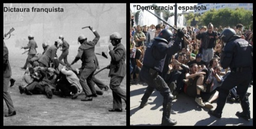

A la izquierda, las temidas Fuerzas de Seguridad del Estado español durante la terrible dictadura fascista de Franco; a la derecha, la actual democracia española, digna de elogio por parte de todos nosotros.

A veces, como ahora, **una imagen vale más que mil palabras**. Nada más que añadir.
