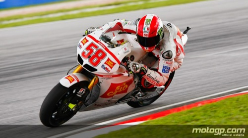

Un accidente ha puesto fin hoy a la vida de Marco. Ese piloto italiano tan carismático que tanto nos hizo vibrar en muchas de sus carreras. Muy del estilo de mi Valentino, con un par de cojones... aunque en vida, muchos lo hayan criticado duramente por su forma de pilotar. Un compañero más que se nos va, al cual espero que los valencianos podamos decirle adiós en Cheste como se lo merecería.

Todos los pilotos están consternados, al igual que los amantes de las dos ruedas nos hemos quedado impactados al recibir la noticia, pero... si me lo permitís, **quiero darle desde aquí muchos ánimos a Colin Edwards**. Sin duda, quien peor estará pasándolo. Y lo que le queda...

Yo no pondré el vídeo de su muerte, ni imágenes siquiera; para mí, es mucho mejor recordarle como encabezo estas líneas: con una foto haciendo lo que mejor sabía hacer. **¡Ráfagas al cielo!**
