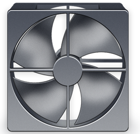

 Quienes me conocéis sabéis que no me caso con nadie. Y es cierto que Apple me ha dado muy buen resultado siempre, pero últimamente estoy desilusionándome un poco. Vale, han sido por dos casos concretos. Lo que me pasó en verano, nada tiene que ver con la empresa en sí; más bien, con gente de ella que no hace su trabajo correctamente. Como pasa en tantísimas otras empresas. Pero en el caso que me ocupa, sí es totalmente culpa de Apple. Hay problemas similares en otros modelos de ordenadores de los que fabrica Apple, pero no sé si se tratará del mismo problema.

El caso es que en los iMac, **desde modelos posteriores al de 2009** —en mi caso me ocurre con un _mid 2010_— **surge un problema cuando reemplazas el disco duro que viene de fábrica**, el denominado _FanGate_. Da igual que lo reemplaces por otro SATA o por uno SSD: el problema siempre va a existir. Existiría, incluso, aunque compraras la misma marca y modelo que tiene el que te venga de fábrica, porque si no ha pasado por las manos de Apple, este problema existirá.

El problema en cuestión es que el ventilador del disco duro, cuando empieza a calentarse, **en lugar de activarse a velocidad reducida e ir elevándose conforme la temperatura vaya subiendo, se activa, desde el principio, a máxima velocidad. Quedándose entre 4500 y 5000rpm normalmente; llegando a subir hasta 6000rpm si estás trabajando con él duramente**. A corto plazo, el problema es que el ruido es bastante molesto; a veces, si no tienes demasiado alto el volumen, hasta lo tapa. A largo plazo, pues como es evidente, el ventilador del disco duro puede estropearse por un desgaste prematuro, y con él, el disco duro a la basura.

Hasta donde sé, Apple introduce un firmware especial a los discos duros que salen de origen, que se encarga de regular la velocidad del ventilador arreglo a la temperatura que tenga. Y como cualquier disco duro que puedas comprar por tu cuenta no va a tener dicho firmware, el ventilador se activa a máxima potencia, ya que no sabe cuánta necesita, para proteger el disco duro.

Por suerte, no está todo perdido: existe [HDD Fan Control](http://www.hddfancontrol.com/). Eso sí, es una aplicación de pago. **Esta aplicación viene hacer lo mismo que hace el firwmare de Apple**. Tienes una versión de prueba, la cual dura operativa una única hora. **Pero más que suficiente como para darte cuenta de la paz que podrías recuperar... la misma que tenías antes, con el disco duro de fábrica**. Es instalarlo y el ventilador se normaliza. Como por arte de magia. Y además, para quienes compren la versión para Mac, se está trabajando en una versión para Windows —para quienes usen bootcamp— y podrá usarse con la misma licencia.

En mi caso, no reemplacé el disco duro por capricho; no quería instalar un SSD, ni siquiera otro de mayor capacidad —aunque con el cambio lo haya hecho—, mi problema fue que el disco duro murió repentinamente. Y en el SAT me pedían aproximadamente 160€ por reemplazarlo por uno igual al que tenía. Total, el precio del disco comprado por mi cuenta y la cantidad que cuesta esta aplicación sigue siendo más barato que el presupuesto inicial que me dieron los técnicos. Si vuestro cambio va a ser simplemente por aumentar las prestaciones de vuestro ordenador, pensadlo bien, y pensad que deberéis comprar esta aplicación —no hay otra opción— si no queréis volveos locos con el modestísimo ruido.

**Aunque mi iMac es una delicia, y siempre lo seguirá siendo, así como tantísimos otros productos de Apple, en este caso se llevan un rotundo cero por mi parte**. Deberían poner las cosas más fáciles a los usuarios. Aunque como siempre, existen soluciones alternativas. Gracias a los benditos desarrolladores.
