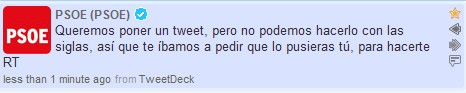

[captura de pantalla original](http://twitpic.com/48f1bn)

**Este gobierno que tenemos cada vez se cubre más de gloria**. Y no es de extrañar ahora mismo, que ocurran cosas como estas. Pero **no deja de sorprendernos, porque aunque sea habitual, nunca será normal, ni lógico**. Quieren decir algo, pero no se atreven a decirlo. ¿La solución? ¡que otro lo diga por ellos! **Lo que se viene conociendo toda la vida como _tirar la piedra y esconder la mano_, pero en versión 2.0**; con Twitter como herramienta de comunicación, un usuario como la piedra que tiras, y el retweet como forma de esconder la mano.

Ya lo he dicho muchas veces: en una dictadura, lo primero que se compran son los medios no afines al régimen; después, algunos lacayos disfrazados de ciudadanos comunes ajenos a la política; para terminar comprando opiniones a favor e **intentar por todos los medios posibles que el ciudadano final no se entere absolutamente de nada de lo que realmente está sucediendo**.

La pena es que **en una dictadura, todas estas cosas se dan por hechas; en una pseudo democracia que enmascara una dictadura como la que más**, como la que tenemos en España, **no te las ves venir**. Aunque **todo empieza a cuadrar cuando sabes que tu presidente se reúne de forma secreta con uno de los máximos dictadores que existen en la actualidad: Hugo Chávez**. Conversación de la cual no se ha hecho absolutamente nada público. Aunque tampoco es que me importe mucho, porque nunca sabríamos la verdad, sólo una versión light y adulterada para agradar a las masas.

Si esto lo hacen en Twitter, de una forma pública a la que todos los que tenemos internet tenemos acceso (aunque cuando se dan cuenta que no les sale como quieren, lo eliminan)... cabe pensar: **¿qué es lo que harán a nuestras espaldas, cuando no tenemos forma de poder averiguar lo que hacen?**
