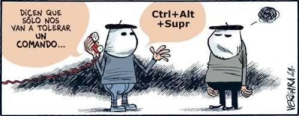

[Territorio Vergara](http://blogs.publico.es/vergara/3149/eta/)

Desde luego, **lo de Vergara no tiene nombre. ¡Es genial!** Me suscribí por RSS a su blog, porque a diario pone unas viñetas increíbles. La de hoy, la que veis sobre estas líneas. Viéndola, comprenderéis lo que me he podido reír, y por qué sigo todas sus viñetas. **Es un crack**.
