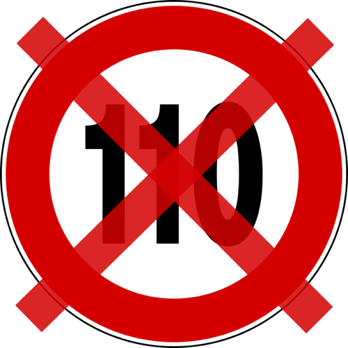

Esta forma de gobernar me hace muchísima gracia. Tanta, que **me caería de culo riéndome, si no fuera porque me afecta directamente**. En este caso, no tan directamente, pues ahora mismo no tengo vehículo, y el único transporte que utilizo para ir a Valencia tiene límite de 100km/h, pero sí me afecta pensando en un futuro, cuando pueda tenerlo, y sobre todo, me afecta porque **pienso que no es mas que una mera ley recaudatoria**. Como prácticamente la mayoría de las que están imponiéndose.

Si la intención de esta gente era que fueran recordados, sin duda alguna lo van a ser. Pero por dejar a España irreconocible. Encima **parece que nos tomen por gilipollas**. Según ellos, esto **es una medida para que ahorremos combustible**, pero por otro lado, hay que cambiar todas las placas de velocidad máxima del país. Como no van a hacerlo, porque si no se les tacharía (más aún) de dictadores, lo solucionan diciendo que _es provisional_, y en lugar de cambiarlas, **les ponen una pegatina encima**, lo cual **supondrá un coste de 250000 euros** al pueblo español. **Cada tontería que les da por hacer, a nosotros nos cuesta dinero**.

> «Nunca había visto las autopistas tan poco transitadas, ojalá pronto vuelvan a subir la velocidad máxima»\- [David Bisbal](http://img62.imageshack.us/img62/6015/no110.jpg)

Habían solicitudes realizadas, donde pedían que en las autovías con mejores condiciones: **rectas, con firme en buen estado, nuevas**, etc, **se cambiara la velocidad máxima de 120 a 140**. Y no es que no hacen caso, **como ya se esperaba**, si no que encima, _para tocar más los cojones_, la reducen. **Tenemos unos coches que en 1973 ni se imaginaban que pudieran existir, unas carreteras que aunque disten mucho de ser las mejores del mundo** (y más aún teniendo en cuenta los guardarraíles) **son lo suficientemente buenas como para aumentar el límite de 120**, tenemos la panacea del carné por puntos, que aunque no sirva de nada, quien se quede sin puntos por excesos de velocidad o infracciones del tipo que sean, se quedan sin carné... ¡**Y tenemos huevos de**, pese a ello, **reducir más la velocidad**! Es increíble.

Yo soy agnóstico, pero si de verdad existe un Dios que, tras nuestro fallecimiento, nos haga pagar todo lo malo que hemos hecho en la tierra, no puedo mas que sentir verdadera pena de esta gente.
