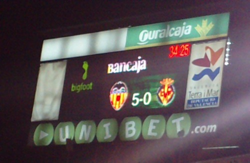

Ayer fue un día estupendo, o más bien, una noche estupenda. El día lo dejaré al margen, ya que no tiene que ver con lo que aquí voy a contar. A estas alturas no habrá nadie que no sepa que **el Valencia le metió una manita al Villarreal**. Una cura de humildad en toda regla, que se la merecían y mucho. **Un equipo que en su historia no ha ganado absolutamente nada no puede pretender ser el primer equipo de la Comunidad Valenciana**. Y mucho menos, decirlo con la facilidad que se dijo. **Corres el riesgo de que te tomen por imbécil**, como es evidente que ha sucedido.

> Queremos ser el equipo que represente a la Comunidad Valenciana en la Liga de Campeones del año que viene.\- Juan Carlos Garrido

**¡Toma representante de la Comunidad Valenciana!** Cuando hayan ganado un título en su vida podrán mirarnos a los ojos, **mientras tendrían que estar calladitos y que ni se les escuchara**. Dicho esto, decir también que me parece una falta de respeto enorme para el Cádiz que esta pachanga dominguera sea reconocida mundialmente como el submarino amarillo. Si no fuera porque el Sr. Roig se dejó los cuartos en el equipo, costándole de su propio bolsillo, estos no serían ni la mitad de lo que son —que no es que sean mucho.

**Garrido, un consejo: antes de abrir la boca piensa lo que vas a decir, no sea que después te coloreen la cara con una Garrinita.**
