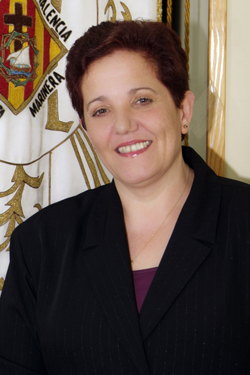

 Retomando la [sección de entrevistas](http://fjp.es/categoria/entrevistas/), que tanto me gusta, hoy quiero presentaros a **Begoña Sorolla Sinisterra**. Ella es la **presidenta de la Junta Mayor de la Semana Santa Marinera de Valencia**. Una de las fiestas más importantes que tenemos en la capital, la cual, además me toca de bien cerca ya que prácticamente llevo acudiendo a la procesión del Santo Entierro desde que nací. La intención de esta entrevista es daros a conocer esta Semana Santa tan peculiar y genuina que tenemos en Valencia a todas aquellas personas que podáis leer esto y no hayáis ido nunca a verla. Seáis gente de fuera de Valencia o valencianos que aun conociendo su existencia, no soláis ir a verla.

Si os animáis a acudir, os diré que **mi sitio favorito desde donde ver**, sobre todo la procesión del Santo Entierro, **es en la plaza de la Parroquia Nuestra Señora de los Ángeles**. Es prácticamente el principio, así que pese a lo larga que es la procesión, **es donde termina más pronto**; hay un bar con terraza detrás, puedes sentarte a tomarse algo; y sobre todo, **un horno donde poder ir a comprar. Os recomiendo las rosquilletas típicas de El Cabañal, están buenísimas**.

1Para aquellos que, en Semana Santa, nunca hayan podido contemplar ningún acto de esta tan tradicional Semana Santa Marinera que tenemos en Valencia, ¿de qué forma les animaría a asistir? ¿qué tiene de especial para usted ésta, y que no tengan otras?

La Semana Santa Marinera de Valencia es una fiesta que se celebra en la ciudad de Valencia en el distrito marítimo, al lado del mar. Se llama Marinera aparte de por el lugar donde se celebra, porque las gentes que la formaron y la forman tienen estrecha relación con el mar. La Semana Santa Marinera de Valencia es una fiesta singular y diferente, porque singulares y diferentes son las gentes que la forman. Es una Semana Santa barroca, mediterránea, alegre, pero a la vez solemne y respetuosa que tiene muchas singularidades que las distinguen del resto de las Semana Santas de España.  
Entre estas singularidades podemos destacar la existencia de personajes bíblicos, personas que complementan los pasos formando una catequesis plástica de la Pasión Muerte y Resurrección de Nuestro Señor Jesucristo. Nuestros crucificados son llevados a pecho, cerca del corazón de los portadores. Martín Dominguez describía a estos portadores como "las mejores andas del mundo".  
La necesidad de las gentes del marítimo de tener las imágenes cerca, hace que estas estén durante los días de Semana Santa en casa de cofrades que mediante sorteo son agraciados con ellas, convirtiéndose así las casas que las albergan en pequeñas iglesias donde los fieles pasan estos días a rezarles, agradecerles, o simplemente a hacerles un rato de compañía. La Semana Santa Marinera es la única Semana Santa de España que celebra al medio día del Domingo de Resurrección un desfile de Gloria en el que participan todas y cada una de las Hermandades, Cofradías y Corporaciones que forman la Junta Mayor de la Semana Santa Marinera de Valencia. En este Desfile, que trascurre por el mismo itinerario del Santo Entierro, no participan los pasos de las hermandades, los colores oscuros cambian por colores claros, las marchas de procesión dejan paso a alegres pasodobles y nuestros personajes bíblicos cambian sus alegorías por ramos de flores que durante el itinerario van lanzando al público que contempla el desfile, para anunciar de este modo la alegría de la Resurrección. Si acuden en Semana Santa a Valencia, podrán descubrir una Semana Santa, como decía antes, singular y un barrio, el del marítimo, acogedor, entrañable, que vibra y disfruta con su fiesta con mayúsculas, La Semana Santa Marinera.

2¿Qué significa para usted ser la presidenta de la Junta Mayor de la Semana Santa Marinera?

En primer lugar un reto y lo que es mas importante, una satisfacción por poder trabajar por una fiesta que es parte importante de mi vida y ¿como no? una gran responsabilidad.

3Dado que en su cargo, entre otras funciones, también se encuentra la de ser punto de unión entre todas las cofradías, ¿cómo valoraría la relación que guardan unas con otras? ¿cuáles han sido las diferencias más significativas desde que usted ostenta el cargo de presidenta?

Las relaciones entre las cofradías son cordiales. Las 32 hermandades que forman la Semana Santa están adscritas a cuatro parroquias del marítimo y cada Junta Parroquial tiene sus peculiaridades. Cada Junta parroquial tiene su forma de entender la celebración de la Semana Santa, pero a la hora de trabajar por su "fiesta" dejan de lado sus peculiaridades para, trabajar todos a una. Esto de puede contemplar en los Actos colectivos que son en los que participan las 32 juntas.

4Como presidenta, ¿qué es lo que más ilusión le hace? ¿la incorporación de nuevos miembros a las cofradías actuales o la creación de nuevas cofradías?

Evidentemente, como presidenta, lo que mas ilusión me hace es que los censos de las cofradías vayan creciendo poco a poco, porque de esta manera nos aseguramos un futuro fuerte. La creacion de nuevas hermandades es positiva siempre y cuando estas se nutran de gente que se incorpora de nuevo a la fiesta. El papel de estas nuevas cofradías ha de ser el de sumar a la Semana Santa, nunca el de restar miembros de otras cofradías.

5Para quien no lo sepa, ¿qué pasos tendría que dar alguien que esté interesado en formar parte de alguna cofradía existente?

Lo único que tendría que hacer cualquier persona que quiera pertenecer a una de las hermandades ya exixtentes, sería acercarse al local social de esa hermandad en cualquier momento del ejercicio, dar sus datos y firmar el alta de cofrade. Allí ya le explicarían cuales serían sus obligaciones y le darían todo tipo de información sobre como conseguir el hábito procesional y sobre todo lo que quisiera saber. En cualquiera de las hermandades, cofradías o corporaciones le recibirán con los brazos abiertos.

6Respecto a la anterior, ¿qué tendría que hacer alguien que esté interesado en formar una nueva cofradía?

Los pasos a seguir para crear una nueva cofradía debe ser en primer lugar, conseguir el permiso del cura párroco de una de las parroquias para formarla. Mas tarde el permiso de una de las Juntas Parroquiales donde se quieran adscribir para pertenecer a ellas, la aprobación de los estatutos por el Arzobispado de Valencia y por último la aprobación de la Asamblea general para su integración en la Junta Mayor. Para todo esto, han de presentar un censo de al menos 20 cofrades.

7Al margen de su cargo como presidenta, ¿qué opina de las demás fiestas de Valencia? Como las Fallas, Moros y Cristianos, y demás.

Valencia es una ciudad festera, posiblemente porque gozamos de unas carácterísticas climáticas favorables y porque tenemos ese caracter alegre y mediterráneo. Todas tienen su lugar y su importancia.

8¿Cree que la juventud actual se implica lo suficientemente como para asegurar que esta tradición perdurará en el futuro?

La juventud actual se implica en la Semana Santa en la misma medida que los adultos, es decir, hay de ellos que trabajan por su cofradía con la misma ilusión y tesón que sus mayores y hay otros que sólo aparecen cuando hay que procesionar. Nuestra Semana Santa tiene un porcentaje importante de jóvenes y sobre todo de niños que evidentemente serán el futuro de la fiesta, por lo que creo que éste esta asegurado.

9¿Cuál, de las procesiones principales, personalmente es la que más le gusta de todas?

Cualquier procesión ya sea particular, parroquial o colectiva me gusta, pero evidentemente, nuestra PROCESION con mayúsculas es la Procesion General del Santo Entierro, porque en ella se muestra todo el patrimonio de la Semana Santa y es el acto central de la celebración, pero no hay que olvidar el Desfile de Gloria, colofón de nuestras procesiones y lo que da sentido a la celebración. La Pasión y Muerte de Nuestro Señor Jesucristo, no tendría sentido sin la Resurrección, que es lo que celebramos en este desfile de Gloria.

10¿Cuál es la pregunta que Begoña Sorolla se haría a sí misma si tuviera que auto entrevistarse?

Dificil pregunta. Posiblemente una de la que se la respuesta y es: ¿Merece la pena el trabajo, el tiempo, los sin sabores, las satisfacciones que comporta la Semana santa? y la respuesta seria SI, así, con mayúsculas, porque nuestra querida fiesta merece luchar por ella, para que se le de el lugar que le corresponde, para que se le reconozca a todos los niveles porque de esta manera se reconocería el trabajo de tantas y tantas personas que han trabajado por ella desde cualquier ámbito.

No me queda mas que agradecer todo el tiempo invertido en las respuestas para la entrevista que a bien tuvo contestar para el blog de este humilde servidor.
