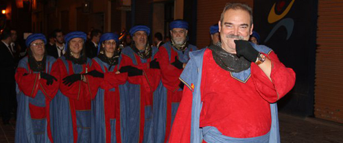

Como [prometía en Twitter el día 7](http://twitter.com/fjpalacios/status/44782270015475712), tras confirmación de ambas, **ibais a poder leer en el blog dos entrevistas realizadas a dos personas muy importantes ligadas a dos de las fiestas más punteras de la Comunidad Valenciana** en general, pero más concretamente, de la ciudad de Valencia. La primera fue con [Begoña Sorolla](http://fjp.es/entrevista-a-begona-sorolla-sinisterra/); esta vez **tengo el placer de presentar, aunque no necesite presentaciones para muchos, a Miguel Ángel Bustos Pizarro**. Él es el **presidente de la agrupación de Moros y Cristianos del marítimo**. Estas fiestas **se celebran en los poblados marítimos durante el primer fin de semana de julio, coincidiendo con la Feria de Julio** de la ciudad de Valencia. Además, muy pronto y como desvela en la entrevista, **tendremos unos actos de «mig any» donde podremos contemplar un _aperitivo_ del espectáculo que sin duda viviremos en julio**. Sin más preámbulos, doy paso a la entrevista que espere que os guste tanto como a mí, y como **espero que de igual forma le haya ocurrido a Miguel Ángel**.

1¿Qué significa para usted ser presidente de la agrupación de Moros y Cristianos del marítimo?

El concepto de Presidencia en los colectivos festeros viene envuelta, si quieres desarrollar bien tu labor, de esfuerzo, de saber rodearte de la mejor gente posible y de saber crear un equipo. En el caso concreto de los Moros y Cristianos lleva otras connotaciones como son el dar a conocer la Fiesta y promocionarla, dado que eres la persona que las representa.

2Para quien nunca haya podido contemplar estos actos, ¿qué tienen de especial los actos que la agrupación celebra durante el mes de julio en Valencia?

Es la esencia de la Fiesta de Moros y Cristianos, el conocimiento de un hecho histórico, el desarrollo del mismo dentro de la Fiesta y en un entorno como es el Marítimo. Y lo que ofrece, colorido, luz, música y pólvora.

3De entre los actos que cada año se celebran, ¿cuál es el que personalmente más le gusta? ¿y el más emotivo?

El Acto más importante de la Fiesta de Moros y Cristiano, sin duda, es la Entrada. Pero no sé si por ser un poco más hijos míos, el Desembarco-Embajadas y el Concurso de Composición de Música Festera “Ciutat de Valencia”, son para mí los más entrañables.

4¿Cómo es la relación entre las distintas comparsas que forman la agrupación?

Pues como en todos los colectivos, unos mejor y otros peor. Pero en general, bien, en ese sentido estamos trabajando para que no sólo esa relación sea en fiestas, sino que se mantenga a lo largo de todo el año. Hay que pensar que la Agrupación es una Federación de Asociaciones, en este caso Comparsas, que a su vez la forman socios.

5Si alguien quisiera pertenecer a alguna comparsa, ¿cuáles serían los pasos que tendría que dar?

Para pertenecer a una Fiesta lo primero que hay que hacer es conocerla, y eso la gente de Valencia lo tiene muy fácil. Todos nuestros actos son abiertos, por ejemplo, los próximos días 8, 9 y 10 de abril, en la Playa de las Arenas, realizamos nuestro Mig Any. Son días de convivencia festera, Ferias Medievales, Entrada Infantil, música danza, campamento y los festeros. La gente que se acerque y hable con nosotros. A la hora de la incorporación y una vez sepa si quiere ser moro o cristiano, de las comparsas que estamos allí puede elegir. Si no, [nuestra página web](http://www.mycmaritimo.com/), con nuestra dirección de correo y teléfono para consultar lo que quieran.

6Como pasa en otros pueblos y ciudades, ¿el número de comparsas existentes es fijo, o pueden ir creciendo en número? En caso de poder crearse nuevas comparsas, ¿qué pasos se tendrían que dar?

No, en Valencia, no es así, todavía. Lo ideal, y así está ocurriendo, es hacer colectivos con una masa social lo más importante posible. Mi recomendación es siempre la misma, hay que engordar las Comparsas. Pero eso no significa que cualquier colectivo de distinta índole, festero, religioso, profesional, económico, etc., que quisiera formar una comparsa debería, primero, ponerse en contacto con nosotros y posteriormente debería constituirse como Asociación Cultural y registrarse en el Registro de Asociaciones de la Generalitat, con el objetivo en la misma, la Fiesta de Moros y Cristianos. Durante todo ese proceso, dado que tarda un tiempo, puede federarse en Marítimo, con todos los derechos. La aportación de cada comparsa a la Agrupación es muy pequeña, funcionamos mucho con atípicos.

7Al margen del cargo como presidente de la agrupación, aunque quienes le escuchamos en «la mesa de las fiestas» de Radio Esport ya nos hacemos una idea, ¿qué significan para usted las demás fiestas de Valencia? Como las Fallas, la Semana Santa Marinera, etc.

Significa todo, cultura, tradición, amor por lo nuestro. Pero desde la perspectiva del conocimiento y la información. Nuestras fiestas, nuestras tradiciones, para quererlas y que reciban el reconocimiento que se merecen, debemos conocerlas, porque será la fórmula para que sepamos trasladar ese espíritu a los que nos releven y les den continuidad. Como dice el profesor de antropología En Françec Llop i Bayo, y a mi me gusta repetirlo, sobre todo en La Mesa de las Fiestas, el patrimonio cultural que recibimos, se debe convertir, realmente, en un _Filimonio_, un traslado a nuestros descendientes. Un “palabro” como todos extraño, pero que dice mucho.

8¿Cree que la juventud está implicándose como debiera con los Moros y Cristianos para que esta fiesta tan tradicional siga perdurando con el paso de los años?

La verdad es que en estos momentos, todavía no estamos donde quisiéramos estar en ese aspecto. Fundamentalmente porque al estar creando la Fiesta desde cero, todavía no no nos ha dado tiempo a complementar la Fiesta con esos actos paralelos que son tan llamativos para los jóvenes, conciertos, discomóviles, fiestas de Juventud, etc. Pero sí tenemos claro que el futuro de la Fiesta pasa por tener una masa de juventud importante, y en ello estamos. Ellos son los que deben dar continuidad a la misma.

9¿Cuál es el «ingrediente clave» sin el cual, para usted, esta fiesta de Moros y Cristianos no sería tal y como la conocemos hoy en día?

Dos, fundamentalmente, la ilusión y el aprecio por lo nuestro, y el segundo, y no menos importante, el que cualquier fiesta, asentada en una localidad debe emanar de abajo hacia arriba, es decir, nace de la gente, de grupo de vecinos, amigos y poco a poco, al correr de los años, se va haciendo grande, deja de ser un conjunto de actos, para convertirse en una Fiesta. Es el mismo nacimiento que “les Festes de Carrer”, sólo que aquí no nos encontramos con un friso o imagen en una calle y a partir de ahí un grupo del barrio empieza una Fiesta, pero sí que es la gente la que la crea. Ese es el planteamiento que yo me marqué como meta desde el minuto uno, hace ahora 16 años.

10¿Cuál es la pregunta que Miguel Ángel Bustos se haría a sí mismo si tuviera que auto entrevistarse?

Realmente no me haría ninguna pregunta porque para hacer funcionar una Fiesta debes contestarte muchas, cada decisión que tomas, es una pregunta que te haces y te la respondes, por tanto, no existe esa gran pregunta, pero sí muchas pequeñas para hacer una Fiesta grande. Pero para entrar en el juego que me propones, voy a trasformar un deseo mío en una pregunta: Miguel Ángel, ¿trasvasarías la Fiesta que habéis montado en ese laboratorio de tradiciones, cultura y fiestas que es el Marítimo, a la Ciudad de Valencia? La respuesta sería: sí. Aún pensando que haciéndola desde Marítimo, la seguimos ofreciendo a toda Valencia, pero evidentemente, el proyecto festero de Moros y Cristianos que tengo pensado para la Ciudad de Valencia, tiene otros aditamentos que convertirían esta Fiesta en puntera entre todas la Fiestas de Moros y Cristianos de la Comunidad y de España. Eso es un sueño que, espero algún día, me permitan llevar a cabo. Por último, darte las gracias, Francisco Javier, por la posibilidad de poder expresar mi opinión ante tus lectores.

Igualmente Miguel Ángel, muchas gracias por haber querido participar en esta entrevista.

Pues ya sabéis, **estáis todos más que invitados tanto a la fiesta de «mig any» que, repito: tendrá lugar los días 8, 9 y 10 de abril en la playa de Las Arenas; como a la fiesta puramente dicha que tendrá lugar el primer fin de semana del mes de julio**. Cuya información, se puede encontrar en la página web de la [Agrupación de Moros y Cristianos del marítimo](http://www.mycmaritimo.com/).

Un placer, Miguel Ángel. ¡Y mucha suerte con ese proyecto de expandir los Moros y Cristianos a la ciudad de Valencia! Sería genial. Igual de genial que el actual proyecto, pero con muchísima más gente.
