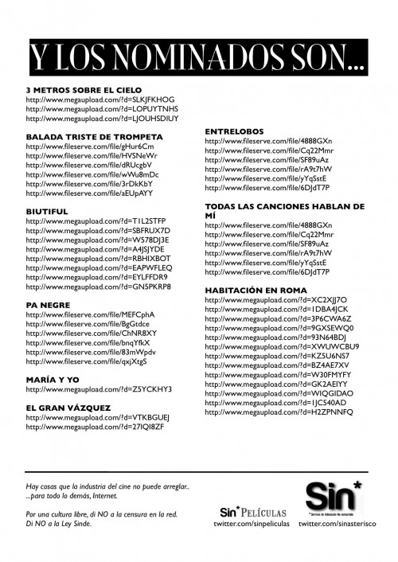

se repartían paskines en las afueras

Y como siempre, aunque no sirva de nada, ahí han estado los **ciudadanos** protestando #operaciongoya contra la maldita #LeySinde

**Editado:** [analizando el contenido del folleto](http://sinasterisco.imgur.com/acerca_del_folleto#) punto por punto de mano de **sus creadores**.
