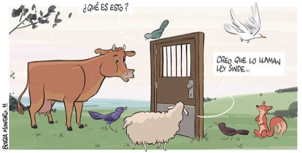

Gracias a **Enrique Dans** (@edans) me encuentro con esta imagen que **Borja Montoro publica para [La Razón](http://www.larazon.es)** donde muestra en una única imagen lo que significa y para qué valdrá la #LeySinde.

click en la viñeta para acceder a la fuente original

Y realmente es cierto, ni se le pueden poner puertas al campo, ni diques al mar. **Cada uno puede tener sus fantasías más húmedas como le plazca, pero la realidad es una y es aplastante**. Por más que a cuatro dictadores encubiertos con ansias de poder y dinero les dé la gana pensar lo contrario.
