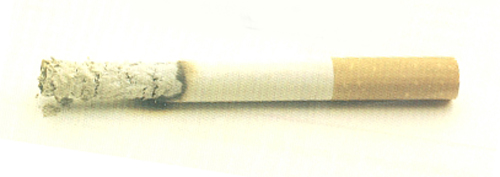

Lo primero, **quiero dejar claro que no soy fumador**. Ni fumo, **ni siquiera he probado el tabaco**, ni espero que fume nunca. Y digo espero, porque no se puede saber nunca lo que pasará en el futuro. Y lo digo bien claro: en mi opinión esta **ley recaudatoria antifumadores enmascarada en ley antitabaco** es una pantomima. Mucho se habla de que hay que ser tolerantes y respetuosos con los que no fumamos, **¿pero y con los que fuman?** Digo bien, recaudatoria, porque es su único cometido: recaudar ingresos para que este gobierno que tan mal gobierna pueda sacar líquido de donde parece que no vaya a haber ni estiércol si no es robándonos a los ciudadanos, que recordemos que **sobre cinco millones estamos parados**, por lo que supongo que las multas que nos pongan querrán que las paguemos en carne...

Si desde el principio esto iba a convertirse en una _caza de brujas_ hacia los fumadores, ¿por qué no se dijo claramente? ¿quizá porque las artimañas de este gobierno sean las de hablar mucho sin que se entienda nada, decir sin decir, y en definitiva, engañarnos? A mí no me afecta en ninguno de los puntos, pero eso no quita que lo vea injusto. De cara a los hosteleros, que han hecho reformas para permitir que en sus establecimientos hayan zonas de fumadores y de no fumadores, ¿por qué han consentido eso? ¿por qué desde un principio no se ha dicho **en este país está prohibido fumar salvo en el domicilio propio**, así claramente, y se habría evitado ir mareando la perdiz? Ahora mismo nos encontramos con una ley que:

- **No permite fumar en la puerta de los hospitales o centros de salud**. En cuanto a los médicos, no tienen otra cosa mejor que hacer que, en su tiempo libre (que presumo que será poco), ir caminando a donde Cristo perdió el gorro para poderse encender un maldito cigarro. Y de cara a los ciudadanos que tienen familiares ingresados y se quedan a cuidarlos, no es suficiente con los nervios que se pasan estando allí, lo mal que se está, y que si eres fumador aún tienes más ganas de fumar, que encima hacen que tengas que darte un viajecito... Y digo yo, la polución que emiten las fábricas de las grandes urbes y la contaminación que producen los coches, que pasan por donde les dé la gana, no importa, ¿no? ¿O el siguiente paso va a ser prohibirlo también?
- **Eso sí, en las cárceles se podrá seguir fumando**. Vamos, que como siempre, los maleantes y delincuentes tienen más derechos y privilegios que nosotros. No es suficiente con las influencias que tienen ya, el consumo de drogas que lo tienen más fácil incluso que si estuvieran fuera y se hace la vista gorda (que alguno que no se ha enganchado fuera, lo hace dentro), que encima también se les permite que ellos sigan fumando. ¿Acaso sus impuestos son de mejor calidad que los nuestros, o pagan más? ¿Volvemos a _los españoles de primera y de segunda_? Ojo, porque la Constitución no permite eso, ya que todos deberíamos ser iguales. ¿Se avecina un decretazo? Forma fácil de gobernar donde las haya.
- **No se podrá fumar, tampoco, en parques públicos**. Imagino que ahora en cada parque habrán cámaras de vigilancia, o los municipales estarán encargados las veinticuatro horas de custodiar esas zonas, dejando de lado otras zonas más conflictivas de los pueblos o ciudades donde pueda haber delincuencia real, y no cuatro padres o abuelos de niños que el único daño que hacen es perjudicarse a sí mismos en lugares donde no se acumula el humo, ya que éste sube hacia arriba, no se queda estancado en lugares abiertos, al aire libre.

Entre todos esos puntos, y las denuncias anónimas que pueden realizarse (ya veremos con el tiempo si son utilizadas de forma vengativa hacia personas contra las que se tenga algo personalmente), ¿es o no es una ley recaudatoria? Y es que al fin y al cabo, es la vía más fácil, la vía de prohibir e ir poniendo decretazos a medida que vayan necesitándose. Que sigan como van, que los pobres están cavándose su propia tumba. Y lo peor de todo es que no se dan ni cuenta, orgullo, prepotencia y chulería ante todo.

Y menos mal que no todos los españoles somos vascos, si no también vendrían a decirnos que **no podemos fumar en el coche si llevamos niños abordo**. Cágate lorito.
