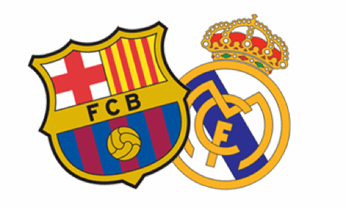

**Lo que más me gusta del fútbol es ver a [mi equipo](http://fjp.es/etiqueta/valencia-cf/) jugar**. Lo ideal sería verlo ganar, pero sobre todo últimamente, eso es bastante difícil. Así que de cuando en cuando me permito la licencia de _ponerle los cuernos_ viendo otros partidos que, a priori, se esperan que tengan la calidad necesaria como para llamarlos, propiamente: **fútbol de calidad**. De ese que a todo aficionado de cualquier equipo le gustaría ver practicar en botas de los suyos. Ese era mi propósito cuando empecé a ver esos «clásicos», pero **cuando llevaba aproximadamente 20 minutos del primero de los cuatro partidos ya supe que no iba a cumplir mi propósito**. Ya sólo me quedaba entonces, como siempre, desearle suerte a todo aquel equipo que juegue contra el Real Madrid.

### Primer partido

Partido de Liga. Para ser el primero todos esperábamos y deseábamos mucha más fuerza, más garra... **Fue un partido decepcionante**. Al finalizar los primeros 45 minutos, si no recuerdo mal, **había sólo un tiro a puerta para cada uno de los equipos**. Algo que no te esperas jamás de un partido, supuestamente, de estas características. Algo, que en caso de que nuestro equipo lo haga, echas pestes de los jugadores, de los entrenadores, y de todo lo que esté relacionado con el equipo y el nefasto partido de ese día. Y si por si eso fuera poco, **el partido terminó en un absurdo empate, fruto de sendos penaltis que el árbitro pitó para cada uno de los equipos**. Si algo puede ser peor que un partido sin sustancia, indiferente, es que los únicos goles que se vean sean desde el punto de penalti decididos por acciones arbitrales.

### Segundo partido

Final de la Copa del Rey, Mestalla. Para mí, **lo único bueno que tuvo este partido fue las aficiones que se sentaban en el campo de mi equipo**. Estuvieron ambas animando todo el tiempo que duró el partido, con **un ambiente que no recuerdo haberlo visto en ese campo siendo el equipo local el Valencia CF**. En serio, chapó a ambas aficiones... ahí se nota que, quienes viajan, son los que realmente se dejan la garganta animando cada partido.

Al margen de esto, **una vergüenza**. Como dije por Twitter en reiteradas ocasiones: **más que cuatro partes parece que hayan habido cuatro asaltos; y que los jugadores, en lugar de futbolistas, fuera púgiles**. La Copa del Rey la ganó el Real Madrid por un gol que podría haber metido cualquiera, **no porque la hubiera merecido ninguno de los dos equipos por la suma total de acciones durante el encuentro**. Más que fútbol **lo que se vio parecía ser un combate de Krav Maga**, pero por ambas partes. Una vergüenza. Cada vez que se tocaba el balón era una falta... me pregunto si no recordaban a qué deporte estaban jugando.

### Tercer partido

Ida de la semifinal de la Champions League. **Dejando a un margen la penosa actuación iniciada por Pinto y seguida por otros futbolistas durante el tiempo de descanso de la primera parte**, tampoco se diferencia demasiado del tercer partido. **Ningún equipo demostró para qué estaba en el campo**; sólo se veían patadas, empujones y mala hostia por doquier. El partido lo salvó para el Barcelona el de siempre, Messi. Metiendo dos goles de esos tan característicos suyos, casi al final del partido. Para dejar con buen sabor de boca a los culés, que veían más cerca la visita a Wembley, pero **no sin dejar, en general, el mal sabor de boca para todos los aficionados del buen fútbol que lo único que pudimos apreciar fue un gran combate dando, entre medias, algunas patadas a una pelota que pasaba por ahí**.

### Cuarto partido

Anoche tuvimos la oportunidad de ver la vuelta de la semifinal de la Champions League. En un partido donde se presumía a un Real Madrid que iba a salir a por todas, porque en caso de no ganar, lo mismo le daba perder por 2 que por 20. Pero **una vez más, no sucedió lo que se esperaba**. En su lugar **pudimos ver un Real Madrid que lanzó contadas ocasiones a puerta**. Y que una vez más, **muchos de los momentos más comentados del partido fueron sus decisiones arbitrales**. Cosa que, realmente, da pena. El partido se empató a 1, con goles de Pedro y Marcelo respectivamente. Pero **en ningún momento dio la sensación de estar viendo un partido de calidad**, lo que pretendía, como dije, cuando empecé a ver estos cuatro partidos.

### En resumen

Resumiendo: **una mierda**. Así, con todas sus letras, para que se me entienda. Y **si lamentable fue el comportamiento de los jugadores dentro del terreno de juego, más lamentable aún lo fue el de los entrenadores, sobre todo de José Mourinho, fuera de él**. Dando un espectáculo más bochornoso si cabe al que de por sí ya nos tiene acostumbrados. No contaré nada que no sepáis, porque hemos tenido Real Madrid y Mourinho hasta en la sopa, pero es que tiene tela... Y **si pretenden ser un club señor, no sé qué hace esa persona aún dirigiendo el banquillo del Real Madrid**. Por mucho menos se echó del equipo tanto a Benito Floro como a Bernd Schuster. **Ahí tenemos el claro ejemplo de que no se aplica la misma vara de medir para todas las personas**.

Más allá de los lloros del Real Madrid y de Llourinho Mourinho, añadir que **me parece lamentable que sean precisamente los dos equipos que más favorecidos salen siempre por las decisiones arbitrales, los mismos que estén quejándose ahora de ellas**. **Otros equipos de Primera División tienen que aguantar esas decisiones continuamente y nunca pasa nada**. Y **si bajas a categorías inferiores, eso se ve a diario y cosas incluso peores**... pero claro: **no son el Real Madrid o el Barcelona; equipos que se presuponen ser los mejores del mundo, pero que después ofrecen partidos de esta clase, que no es que sean para olvidar, si no que preferiríamos que no se hubieran siquiera disputado**.

Si queréis opinad: **¿qué os parecieron a vosotros los cuatro encuentros?**
