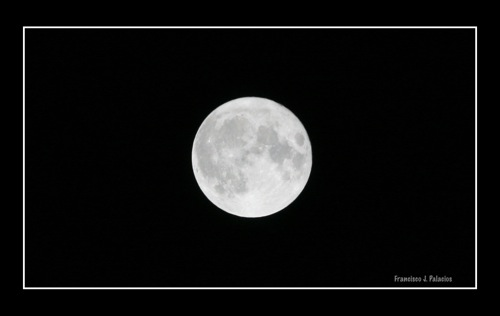

Esta es la luna que hemos tenido en Valencia **la madrugada del 19 al 20 de marzo**. Según dicen, **desde hace 19 años no había estado tan cerca** de la tierra como lo ha estado ahora... Y como yo dije en su día, cuando me enteré: **¡ni siquiera la luna ha querido perderse la «cremà» de las fallas!**

Fotografía realizada por mí mismo. :)
