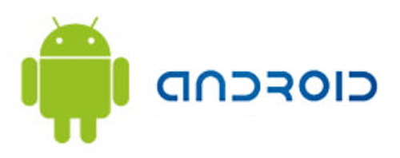

Quienes me seguís sabréis que [mis inicios en Android no fueron fáciles](http://fjp.es/etiqueta/vodafone/); aunque como ya dije, no fue culpa de Android, ni de Google, ni de Huawei... fue íntegramente culpa de Vodafone, a quien compré el teléfono. **Cuestión de la que prefiero olvidarme y esperar no tener más problemas —sean del tipo que sean— con ellos**.

Quizá este artículo llega tarde, porque desde que empecé a utilizar Android he ido dando unos cuantos pasos, lo que me hacen tener no tan frescos los primeros, pero antes de seguir avanzando en la historia quiero empezar por el principio. Para quienes me sigáis desde hace tiempo, no os vendrá de nuevo si digo que **mi ilusión de siempre fue tener un iPhone**... pero por diversos motivos, nunca ha podido ser. **Mi idea principal era tenerlo o no tener ningún smartphone** hasta poder tener el que yo quería. La cual cambió, pensándolo en frío, y viendo que iba a pasar demasiado tiempo antes de que mi deseo pudiera hacerse realidad. **Una oferta de Vodafone, ofreciendo un teléfono de gama baja Android por 69€ en prepago hizo que me decidiera a dar el salto y conocer de primera mano el mundo de los smartphones**. Mundo del cual, sea con el terminal que sea, ya no quiero salir... porque sinceramente, esto es una maravilla.

**Cuando recibí el Vodafone 858 Smart no sabía bien qué esperar**; tanto por las prestaciones del teléfono en sí, como por el sistema operativo que tenía. Sabía que no iba a ser igual que el iPhone, y sabía incluso que no iba a ser como cualquier otro terminal Android más potente, aunque ambos lleven el mismo sistema operativo instalado. **El teléfono es bien justito, tanto de espacio —sobre todo— como de memoria RAM —se vuelve lento en ocasiones—**. Lo cual impide el uso de ciertas aplicaciones con soltura. Y algo que me dio mucha más rabia fue que **la calidad de la cámara impida la instalación de algunas de las mejores aplicaciones fotográficas que existen para Android**, como [Camera360](https://market.android.com/details?id=vStudio.Android.GPhotoPaid&feature=search_result), por ejemplo. Después utilicé Google Street View y daba fallos... es decir, no se podía utilizar. Básicamente, **todo lo que empecé probando no funcionaba como esperaba**. Estaba un poco desilusionado, ya no con Android, porque Android es evidente que esas aplicaciones puede utilizarlas, si no con el terminal en cuestión, que es el que no lo permite.

Dejando a un lado el pesimismo, me puse a buscar aplicaciones que sí puedo instalar, y buscar la parte positiva de todo esto, que sin duda la tiene. Aplicaciones que considero importantes, como Twitter y Facebook, aunque con una versión bastante vieja —se actualizan, claro—, ya vienen preinstaladas con el sistema operativo. Realmente, es lo que más horas de entretenimiento me aportan. Otra aplicación clave es WhatsApp, de la cual tampoco explicaré su funcionamiento porque es de sobra conocida por la inmensa mayoría de personas. A partir de ahí, empecé a instalar otras... **hasta que me quedé sin espacio**. La mayoría de las aplicaciones puedo pasarlas a la tarjeta de memoria externa, la cual es bastante difícil llenar, porque **aunque pases esas aplicaciones a la memoria externa siempre te queda algo en la memoria interna del teléfono**... y teniendo en cuenta lo justita que es, **se llena con una facilidad pasmosa**. Me conformé con ello durante un tiempo, _sin más_. Resignación ante las cosas que no me gustaban, y alegría por poder tener las que sí funcionaban, ya que habiendo pasado de un _patatófono_ —como así le bauticé yo— a un smartphone, por básico que sea, la diferencia es abismal.

Ahora bien... **¿Desde cuándo me conformo yo con algo, _sin más_, pudiendo tener solución?** En el próximo artículo contaré qué he hecho para que el teléfono **haya cambiado del cielo a la tierra**. Y que, en gran parte, ya pueda ser ese teléfono que quería tener. **Pese a que no sea ni un iPhone ni un Samsung Galaxy SII, no hay que engañarse tampoco**.
