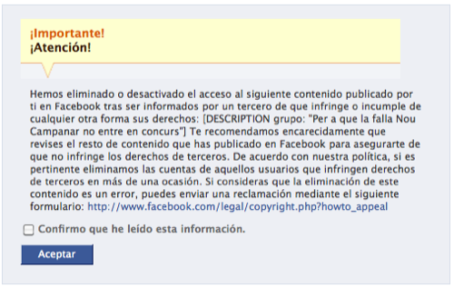

Si ayer me desperté con la _agradable_ noticia de que [Nou Campanar quería que cambiara la imagen de mi grupo de Facebook](http://fjp.es/nou-campanar-y-la-falta-de-auto-critica/), hoy, no conformes con ello, parece que les ha dado por querer que Facebook borre mi grupo. Y como muestra la imagen y un correo que he recibido por parte de Facebook, parece que lo han conseguido. El correo reza así:

> Hola,
> 
> Hemos eliminado o desactivado el acceso al siguiente contenido publicado por ti en Facebook tras ser informados por un tercero de que infringe o incumple de cualquier otra forma sus derechos: \[DESCRIPTION grupo: "Per a que la falla Nou Campanar no entre en concurs"\] Te recomendamos encarecidamente que revises el resto de contenido que has publicado en Facebook para asegurarte de que no infringe los derechos de terceros. De acuerdo con nuestra política, si es pertinente eliminamos las cuentas de aquellos usuarios que infringen derechos de terceros en más de una ocasión. Si consideras que la eliminación de este contenido es un error, puedes enviar una reclamación mediante el siguiente formulario: http://www.facebook.com/legal/copyright.php?howto\_appeal
> 
> El equipo de Facebook

Vamos, que básicamente me dice lo mismo que dice la imagen que adjunto. Y yo me pregunto, ¿tan mal espíritu fallero reina en esta comisión supuestamente fallera? ¿no aceptan, según sus palabras, opiniones que _desacrediten Nou Campanar_? Por favor, **que alguien me explique qué parte es la que les desacredita exactamente**.

Espero que cuando en una de sus putrefactas pero carísimas fallas se metan con alguien, éste les ponga las pilas. Que les metan una querella por tomarse con el mismo humor su ironía, sátira y crítica con el que se han tomado mi grupo, y lo malo que en él pudiera haber. Realmente, en el fondo no lo espero, porque espero que todavía haya gente que sepa cuál es el fin de las fallas, y sepa aceptar ese tipo de situaciones de la mejor forma posible, **cosa que claramente Nou Campanar no sabe hacer**.

**Vaya personajes...**
