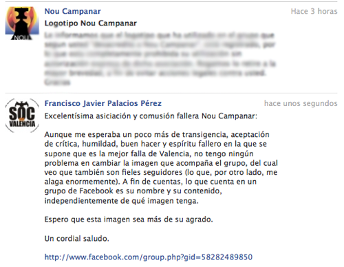
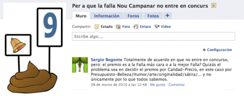

Hace poco más de dos años creé un grupo reivindicativo, que por aquella época, incluso tenía más gente afín que la propia página de Nou Campanar. El grupo al cual hago referencia es [Per a que la falla Nou Campanar no entre en concurs](http://www.facebook.com/#!/group.php?gid=58282489850). Y aunque es de fácil traducción del valenciano al español, lo traduzco: **Para que la falla Nou Campanar no entre en concurso**. Quienes más o menos estáis enterados de lo que viene sucediendo año tras año en Valencia (excepción hecha, gracias a Dios, de las fallas de 2010), sabréis que hay una falla (la comentada) que gracias al elevadísimo presupuesto que tienen, sobre pasan en dos y hasta tres veces el presupuesto de la falla que, por orden presupuestario, cada año pueda ir en segundo lugar. Y tanto para mí como para otros valencianos, es injusto.

Este grupo, por contra de lo que a priori parezca, **no es un grupo en contra de la comisión fallera**. Y no lo es, porque en la pestaña de información se explica bien claro el motivo de creación del grupo, y qué reivindica. Lo malo que puede tener este y tantos otros grupos de Facebook, no son la creación de los mismos, si no la gente que entra, lee el nombre, y ni se para a mirar cuál es su fin, ni siquiera a leer qué es lo que hay puesto en el grupo, más allá del nombre. Como en tantos otros casos, es un problema humano, qué le vamos a hacer.

Después de este rollo, pensaréis, ¿a santo de qué cuenta ésto este tío? Pues bien, la sorpresa que me esperaba al leer hoy mi correo era **un curioso a la par que amenazador mensaje de Nou Campanar**. Del cual, ya sé que no puedo hacer reproducción por tratarse de correspondencia privada, aunque sí puedo resumirlo y hacer pública mi respuesta, así que procedo.

> \[...\] bla, bla, bla \[...\] eres malo \[...\] bla, bla, bla \[...\] nuestro logotipo está protegido \[...\] bla, bla, bla \[...\] no puedes utilizarlo \[...\] bla, bla, bla \[...\] introduce tu amenaza favorita aquí \[...\] bla, bla, bla \[...\]

Y en fin, aunque ya sé que en la primera línea tengo dos errores tipográficos de los que no me di cuenta al enviar el mensaje privado vía Facebook (ya lo digo yo, así nadie tiene que decírmelo, que lo sé), lo que importa es el mensaje en sí. Y es que _manda huevos_ que la que se supone que es _la mejor falla_ de Valencia no conozca el espíritu de sátira y crítica tan típico de las fiestas josefinas de esta Comunidad.

Para que quede claro que el grupo no va con intención de perjudicar a la comisión, si no como una simple reivindicación, traduzco lo que se puede encontrar en la pestaña de información del grupo:

> Como en su día se hizo con la falla de la Plaza del Ayuntamiento, queremos que la falla Nou Campanar no entre en concurso. Que hagan lo que les dé la gana, pero lo que no puede ser es que se dejen novecientos mil euros en la falla y que la siguiente falla tenga un coste de poco menos de trescientos mil euros.
> 
> ATENCIÓN: no es una crítica para Nou Campanar, si no para JCF **(Junta Central Fallera)**. Ellos son quienes tendrían que poner un coste máximo para las fallas de sección especial. Es obvio que si gracias al Sr. Armiñana Nou Campanar tiene dinero para dejárselos, que lo haga, y todos de acuerdo con eso.
> 
> SI QUERÉIS QUE VALENCIA TENGA **DOS GRANDES FALLAS COMO SON LA DE LA PLAZA DEL AYUNTAMIENTO Y NOU CAMPANAR** FUERA DE CONCURSO Y DEJAR QUE LA PLAZA DEL PRIMER PREMIO DE SECCIÓN ESPECIAL SEA UN POCO MÁS COMPETITIVA, ÉSTE ES VUESTRO GRUPO.

Como veréis, es evidente que mis críticas no van dirigidas a la comisión, si no a quienes permiten que eso sea como es. Aunque poco a poco, van regulándose estos tema, y me alegro enormemente. Ahora sí, os dejo con el diseño que he hecho de buena mañana, mucho más acorde a esta situación. Del cual, espero que no haya ningún registro realizado, porque los derechos de autor son claramente míos y de mi prodigiosa imaginación.

Espero que, como dije, éste sea más del agrado de esta comisión.

**Editado:** a día de hoy, 3 de febrero de 2011, he recibido [un mensaje de Facebook donde se me comunica que el grupo va a ser cerrado](http://fjp.es/nou-campanar-y-la-falta-de-auto-critica-ii/). **¡Viva la censura!**
