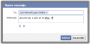
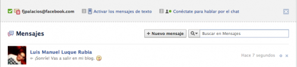
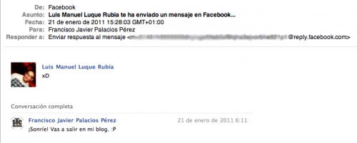
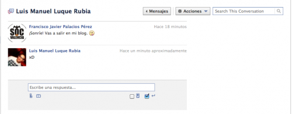
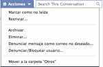

Hace tiempo que Facebook presentó las nuevas características del nuevo correo electrónico que va implementando, progresivamente, entre cada uno de sus usuarios. **No ha sido hasta hace tres días cuando me han activado, por fin, la característica. Y me encanta, funciona francamente bien. Tiene una apariencia **rapidísima**, la estética minimalista de Facebook**, y aunque no se trate de una dirección de correo como las conocemos hasta ahora, la verdad es que aparte del ya conocido tema de dejar a un lado el asunto del mensaje, es tal cual lo conocíamos hasta ahora. **Realmente no se ha inventado nada nuevo, pero queda genial.**

 Hasta ahora, como sabíamos y comentaba, cuando enviabas un mensajes privado a alguien, además de indicar para quién iba y el contenido de ese mensaje, debías indicar un asunto. Aunque también cabe destacar que era opcional, podías dejarlo en blanco. Eso ya no existe, ahora directamente no aparece. Podéis comprobarlo en la imagen. Lo que también es cierto es que cuando te envían un correo electrónico donde sí sigue habiendo asunto, éste **aparece en negrita en la primera línea del mensaje**. Así nada se _pierde_.

La lista de mensajes no cambia prácticamente respecto a la anterior, como se puede apreciar en la imagen. La diferencia es que ahora las conversaciones mantenidas anteriormente tanto con usuarios de Facebook como con direcciones de correo electrónico externas pueden _archivarse_ o eliminarse. Si las archivas, consigues que no estén ahí, pero que sigan estando; la forma de _recuperarlas_ es buscándolas mediante el buscador que tenemos a la derecha. Si las eliminas, pues evidentemente ya no podrán ser recuperadas de ninguna forma.

Además, ahora cuando recibes mediante correo electrónico un aviso de que tienes un nuevo mensaje esperándote en Facebook, lo hace **mucho mejor formateado**. Y sobre todo, lo más importante, **también deja que veas la conversación mantenida hasta el momento**, para que sepas _de qué va_ y no sea necesario que entres a Facebook para saberlo, si es que no es necesario responder a ese mensaje ahora mismo. Creo que es un buen detalle, ya que antes, si había una o varias conversaciones abiertas, no sabías a qué respondía ese mensaje, sólo veías la respuesta en sí.

La ventana de conversación ahora además permite mucha más velocidad a la hora de enviar los mensajes. Antes, por obligación, para enviar un mensaje debías hacerlo mediante el ratón, dándole al botón de enviar. Ahora también tienes la opción de _envío rápido_, con el que si marcas la casilla correspondiente (en la imagen puede verse), **al presionar el botón de _intro_, automáticamente el mensaje será enviado**. Es cierto que a veces puedes presionarlo sin darte cuenta, pero para mí es muy cómodo. Cuestión de gustos, supongo.

 También tienes en esa misma ventana, un botón de opciones llamado **acciones**. Desde él es desde donde se pueden eliminar las conversaciones, ya que le botón con la **x** de la ventana donde se listas los mensajes ahora no elimina los mensajes si no que los oculta (opción de archivar). Aparte, también podemos reenviar un mensaje o conjunto de ellos, marcándolos, **tal y como podemos hacer con cualquier otro correo electrónico**. Y en fin, todas las opciones que veis.

Las _carpetas_ de notificaciones (donde recibíamos los mensajes que nos enviaban desde los grupos) o enviados ahora han desaparecido. Sólo tenemos la carpeta mensajes, la que hace a su vez de **bandeja de entrada** y la carpeta de **Otros**, donde irán los mensajes que nos envíen de los grupos entre otros, supongo, pero aún no me dio tiempo a averiguar cuáles.

De este modo, ahora a la hora de enviar un mensaje, **podemos especificar un usuario de nuestra lista de amigos, o bien una dirección de correo electrónico**. El mensaje se enviará igualmente, y tal como permite el correo electrónico y los mensajes venían permitiendo hasta ahora, **también podremos enviar archivos adjuntos, y que nos los envíen**. Cuando los recibamos, **también tendremos la opción de descargarlos**.

**A mí me encanta**. :D
